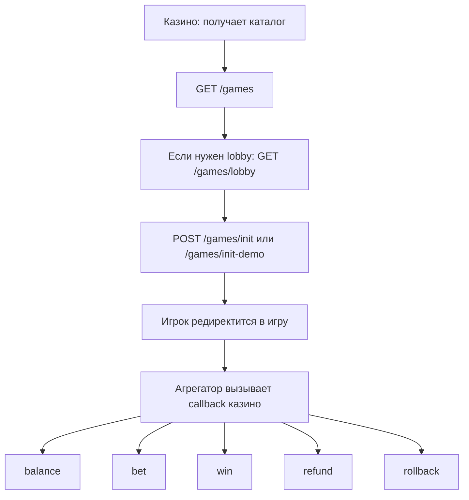
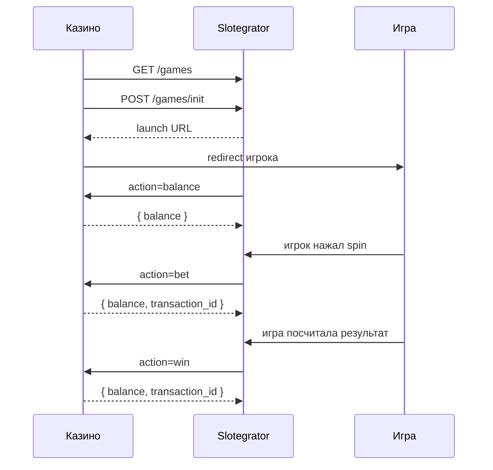
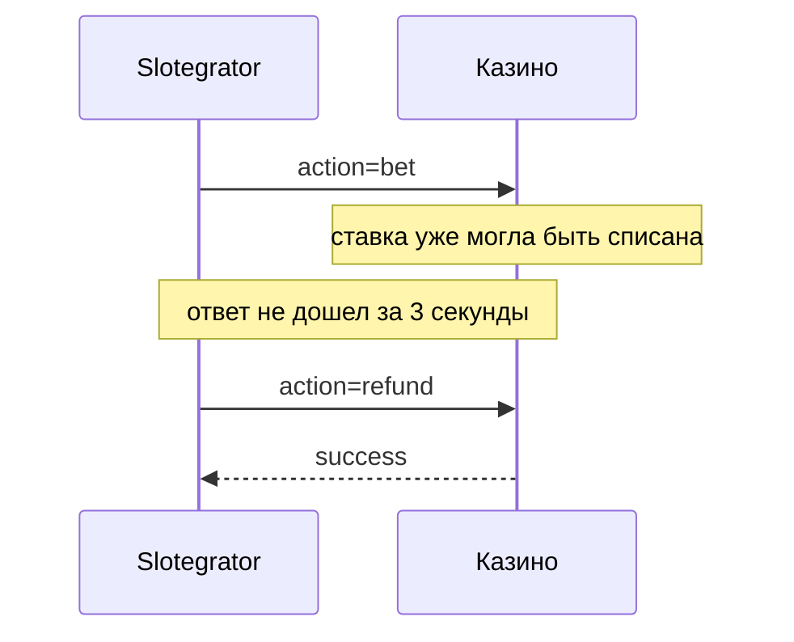
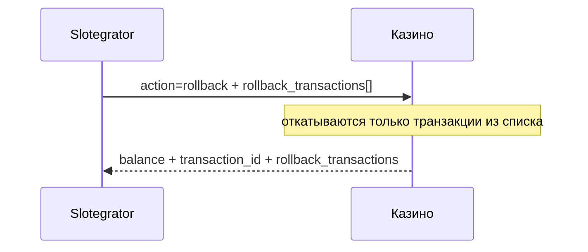

# API Slotegrator

> Документ составлен **только** по PDF `GIS-API_Slotegrator 1.4.4.pdf`.
>
> Если в PDF нет достаточных данных для точного вывода, это **прямо помечено** в тексте как `Недостаточно данных в PDF`.

## Оглавление

- [1. О документе и источнике](#1-о-документе-и-источнике)
- [2. Общая модель API](#2-общая-модель-api)
- [3. Базовые правила API](#3-базовые-правила-api)
- [4. Безопасность и подпись запросов](#4-безопасность-и-подпись-запросов)
- [5. Общая схема взаимодействия](#5-общая-схема-взаимодействия)
- [6. Каталог игр и запуск игры](#6-каталог-игр-и-запуск-игры)
- [7. Callback API: как агрегатор ходит в backend казино](#7-callback-api-как-агрегатор-ходит-в-backend-казино)
- [8. Дополнительные методы агрегатора](#8-дополнительные-методы-агрегатора)
- [9. Freespins API](#9-freespins-api)
- [10. Freevouchers API](#10-freevouchers-api)
- [11. Self validation](#11-self-validation)
- [12. Схема прохождения транзакций](#12-схема-прохождения-транзакций)
- [13. Что обязательно учесть при реализации](#13-что-обязательно-учесть-при-реализации)
- [14. Что в PDF не раскрыто полностью](#14-что-в-pdf-не-раскрыто-полностью)

---

## 1. О документе и источнике

Этот файл описывает API Slotegrator на русском языке по документу:

- `GIS-API_Slotegrator 1.4.4.pdf`

Версия документа:

- `1.4.4`
- дата в changelog: `2026-02-26`

По PDF видно, что API делится на две большие части:

1. **Game Aggregator API**
   Это методы, в которые ходит интегратор казино.
2. **Integrator callbacks**
   Это вызовы, в которые уже агрегатор ходит в backend казино во время игры.

Также в PDF есть дополнительные блоки:

- лимиты;
- jackpots;
- freespins;
- freevouchers;
- self validation.

---

## 2. Общая модель API

Slotegrator API работает по такой схеме:

1. Казино получает каталог игр.
2. Если игре нужен lobby, казино отдельно получает данные lobby.
3. Казино инициализирует игровую сессию.
4. Игрока редиректят в игру.
5. Во время игры агрегатор ходит в callback endpoint казино за:
   - балансом;
   - списанием ставки;
   - начислением выигрыша;
   - refund;
   - rollback.

То есть это **seamless wallet** схема:

- игра живет у агрегатора;
- деньги игрока живут у казино;
- агрегатор обращается к казино при денежных событиях.

Основание в PDF:

- launch flow: стр. `5-6`
- `/games`, `/games/lobby`, `/games/init`, `/games/init-demo`: стр. `8-14`
- callbacks `balance`, `bet`, `win`, `refund`, `rollback`: стр. `14-21`

---

## 3. Базовые правила API

### 3.1. Транспорт

Для запросов интегратора к агрегатору в PDF указано:

- HTTP/1.1
- параметры передаются как `application/x-www-form-urlencoded`

Основание:

- общий раздел API, стр. `2-3`

### 3.2. Формат ответа

По умолчанию ответы агрегатора — JSON:

- `Content-Type: application/json`

Основание:

- стр. `3`

### 3.3. HTTP-коды

В PDF перечислены стандартные HTTP-коды:

- `200`
- `201`
- `204`
- `304`
- `400`
- `401`
- `403`
- `404`
- `405`
- `415`
- `422`
- `429`
- `430`

Основание:

- стр. `3`

### 3.4. Пагинация

Для коллекций используются стандартные заголовки пагинации:

- `X-Pagination-Total-Count`
- `X-Pagination-Page-Count`
- `X-Pagination-Current-Page`
- `X-Pagination-Per-Page`
- `Link`

Основание:

- стр. `3-5`

### 3.5. Важное ограничение по `/games`

PDF отдельно говорит:

- на production сервере возвращается не больше `50` игр на страницу;
- `per page = 0` на production не работает;
- список игр должен кэшироваться на стороне клиента;
- запрещено публиковать URL изображений агрегатора напрямую во frontend.

Основание:

- `/games`, стр. `8`

---

## 4. Безопасность и подпись запросов

### 4.1. Заголовки авторизации

Для запросов к агрегатору и для callback-вызовов от агрегатора используются заголовки:

- `X-Merchant-Id`
- `X-Timestamp`
- `X-Nonce`
- `X-Sign`

Основание:

- запросы интегратора к агрегатору: стр. `6-7`
- callbacks агрегатора в казино: стр. `15`

### 4.2. Как считается подпись

Подпись строится так:

1. объединяются параметры запроса и авторизационные заголовки;
2. массив сортируется по ключу по возрастанию;
3. строится URL-encoded строка;
4. поверх нее считается `sha1 hmac` с `Merchant Key`.

Основание:

- стр. `6-7` для запросов к агрегатору
- стр. `15` для callback-проверки со стороны интегратора

### 4.3. Ограничение по времени

`X-Timestamp` считается просроченным, если отличается от текущего времени более чем на `30 секунд`.

Основание:

- стр. `6`
- стр. `15`

### 4.4. Что нужно реализовать на стороне казино

Backend казино должен:

- проверять подпись каждого callback-запроса;
- отклонять запросы с невалидной подписью;
- учитывать ограничение по timestamp;
- не считать подпись только по телу запроса без заголовков, потому что PDF прямо требует объединять и body, и auth-заголовки.

---

## 5. Общая схема взаимодействия

### 5.1. Что делает казино

Казино:

- получает игры;
- показывает каталог;
- инициализирует игровые сессии;
- хранит баланс игрока;
- отвечает на callback-вызовы агрегатора.

### 5.2. Что делает агрегатор

Агрегатор:

- отдает каталог игр;
- готовит launch URL;
- во время игры сообщает о денежных событиях;
- запускает freespins и freevouchers механики;
- может прогонять self-validation.

---

## 6. Каталог игр и запуск игры

### 6.1. `GET /games`

**Назначение**

Получение списка игр, доступных для Merchant ID.

**Основание**

- стр. `8-10`

**Ключевые поля игры**

- `uuid`
- `name`
- `image`
- `type`
- `provider`
- `provider_id`
- `technology`
- `has_lobby`
- `is_mobile`
- `has_freespins`
- `has_tables`
- `freespin_valid_until_full_day`
- `label`

**Параметры**

- `expand`
- `filter[provider]`
- `filter[is_mobile]`
- `filter[has_freespins]`

**Доступные expansions**

- `tags`
- `parameters`
- `images`
- `related_games`

**Что важно**

- список игр нужно кэшировать;
- статические изображения тоже нужно кэшировать;
- прямые URL картинок агрегатора не должны светиться во frontend.

### 6.2. `GET /game-tags`

**Назначение**

Получение списка игровых тегов.

**Основание**

- стр. `10-11`

**Поля**

- `code`
- `label`

**Expansion**

- `category`

### 6.3. `GET /games/lobby`

**Назначение**

Если у игры есть lobby, этот метод возвращает список столов и данные lobby.

**Основание**

- стр. `11-12`

**Параметры**

- `game_uuid`
- `currency`
- `technology` — необязательный фильтр по `html5` или `flash`

**Что приходит**

Внутри `lobby`:

- `lobbyData`
- `name`
- `isOpen`
- `openTime`
- `closeTime`
- `dealerName`
- `dealerAvatar`
- `technology`
- `limits`
- `tableId`

**Что важно**

- `lobbyData` потом нужен для `/games/init`;
- `tableId` позже может использоваться в `/freevouchers/set`.

### 6.4. `POST /games/init`

**Назначение**

Подготовка игры к запуску и получение финального URL для редиректа игрока.

**Основание**

- стр. `12-13`

**Параметры**

- `game_uuid`
- `player_id`
- `player_name`
- `currency`
- `session_id`
- `device` — опционально, `desktop` или `mobile`
- `return_url`
- `language`
- `email`
- `lobby_data` — если игра использует lobby

**Ответ**

- `url`

### 6.5. `POST /games/init-demo`

**Назначение**

Подготовка demo-сессии для игры, если провайдер поддерживает demo mode.

**Основание**

- стр. `13-14`

**Параметры**

В PDF явно видны:

- `game_uuid`
- `device`
- `return_url`
- `language`

**Недостаточно данных в PDF**

На видимом фрагменте PDF список полей `/games/init-demo` показан не полностью. Поэтому в документе нельзя утверждать, что это полный список параметров.

**Ответ**

- `url`

### 6.6. Особенности launch flow

PDF прямо предупреждает о двух важных сценариях:

1. После `init` внутри игры может быть запущена другая игра, и тогда callbacks могут прийти с другим `game_uuid`, но с тем же `session_id`.
2. Ставка может пройти в mobile-версии, а выигрыш — в desktop-версии, и тогда `session_id` у `bet` и `win` может отличаться, но `round_id` будет один и тот же.

Основание:

- стр. `12-14`

Это важнейшее требование к внутренней модели данных казино: привязка только к `session_id` недостаточна, нужно хранить и `round_id`.

---

## 7. Callback API: как агрегатор ходит в backend казино

### 7.1. Общие правила callback API

По PDF:

- все callback-вызовы идут через `POST`;
- body передается как `application/x-www-form-urlencoded`;
- ответ интегратора должен быть `HTTP 200 OK`;
- `Content-Type: application/json`;
- агрегатор ждет ответ не более `3 секунд`.

Основание:

- стр. `14-15`

### 7.2. Почему важны 3 секунды

PDF прямо пишет:

- если казино не успело ответить за `3 секунды`, агрегатор считает запрос неуспешным;
- после этого агрегатор следует своему "типичному flow":
  - шлет `refund` для неуспешного `bet`;
  - либо повторно шлет `win`, `refund` или `rollback`.

Основание:

- стр. `14`

Это означает, что backend казино обязан быть:

- быстрым;
- идемпотентным;
- готовым к повторной доставке.

### 7.3. Формат ошибок

В случае ошибки интегратор должен вернуть JSON:

- `error_code`
- `error_description`

При этом HTTP-код все равно `200 OK`.

Основание:

- стр. `14-15`

### 7.4. Поддерживаемые error_code

В PDF явно указаны:

- `INSUFFICIENT_FUNDS` — для `bet`, когда у игрока недостаточно денег
- `INTERNAL_ERROR` — для остальных общих ошибок

Основание:

- стр. `15`

### 7.5. `action=balance`

**Назначение**

Получить актуальный баланс игрока.

**Основание**

- стр. `16-17`

**Поля запроса**

- `action = balance`
- `player_id`
- `currency`
- `session_id` — если эта опция включена

**Ответ**

- `balance`

### 7.6. `action=bet`

**Назначение**

Списание ставки игрока.

**Основание**

- стр. `17-18`

**Типы ставки**

- `bet`
- `tip`
- `freespin`

**Поля запроса**

- `action = bet`
- `amount`
- `currency`
- `game_uuid`
- `player_id`
- `transaction_id`
- `session_id`
- `type`
- `freespin_id`
- `quantity`
- `round_id`
- `finished`
- `transaction_datetime`
- `casino_request_retry_count`

**Ответ**

- `balance`
- `transaction_id`

**Критически важное правило**

PDF прямо требует:

- bet с данным `transaction_id` должен быть обработан только один раз;
- если он уже был обработан, нужно вернуть успешный идемпотентный ответ с тем же внутренним `transaction_id`.

### 7.7. `action=win`

**Назначение**

Начисление выигрыша игроку.

**Основание**

- стр. `18-19`

**Типы выигрыша**

Базовые:

- `win`
- `jackpot`
- `freespin`

Дополнительные типы, перечисленные в PDF:

- `bonus`
- `pragmatic_prize_drop`
- `pragmatic_tournament`
- `promo`
- `prize_drop`
- `tournament`
- `unaccounted_promo`
- `loyalty_win`

**Поля запроса**

- `action = win`
- `amount`
- `currency`
- `game_uuid`
- `player_id`
- `transaction_id`
- `session_id`
- `type`
- `freespin_id`
- `quantity`
- `round_id`
- `finished`
- `transaction_datetime`
- `casino_request_retry_count`

**Ответ**

- `balance`
- `transaction_id`

**Критически важное правило**

Как и для bet:

- win с данным `transaction_id` обрабатывается только один раз;
- повтор должен вернуть идемпотентный успешный ответ.

**Отдельная оговорка из PDF**

Для freespin wins провайдера ELK `round_id` может не передаваться.

Основание:

- стр. `19`

### 7.8. `action=refund`

**Назначение**

Возврат денег в случае проблем со ставкой.

**Основание**

- стр. `19-20`

**Поля запроса**

- `action = refund`
- `amount`
- `currency`
- `game_uuid`
- `player_id`
- `transaction_id`
- `session_id`
- `type`
- `bet_transaction_id`
- `freespin_id`
- `quantity`
- `round_id`
- `finished`
- `transaction_datetime`
- `casino_request_retry_count`

**Ответ**

- `balance`
- `transaction_id`

**Самое важное правило**

PDF прямо требует:

- после `refund` интегратор должен отменить соответствующую `bet`-транзакцию и вернуть деньги игроку;
- если такой `bet`-транзакции еще нет, интегратор должен **сохранить refund** и все равно ответить успехом.

Это значит:

- `refund` может приходить раньше, чем найден исходный `bet`;
- без таблицы отложенных операций это безопасно реализовать нельзя.

### 7.9. `action=rollback`

**Назначение**

Откат целого раунда или части сессии, если провайдер не поддерживает раунды.

**Основание**

- стр. `20-21`

**Поля запроса**

- `action = rollback`
- `currency`
- `game_uuid`
- `player_id`
- `transaction_id`
- `rollback_transactions[]`
- `session_id`
- `type = rollback`
- `provider_round_id`
- `round_id`
- `transaction_datetime`
- `casino_request_retry_count`

**Содержимое `rollback_transactions[]`**

Для каждого элемента массива:

- `action` — `bet`, `win` или `refund`
- `amount`
- `transaction_id`
- `type`

**Ответ**

- `balance`
- `transaction_id`
- `rollback_transactions`

**Самое важное правило**

PDF прямо говорит:

- интегратор должен откатывать **только** транзакции из `rollback_transactions`;
- нельзя на своей стороне расширять rollback на весь раунд только по `provider_round_id`, потому что это может породить ошибки из-за рассинхронизации данных.

Это одно из самых важных архитектурных требований документа.

---

## 8. Дополнительные методы агрегатора

### 8.1. `GET /limits`

**Назначение**

Возвращает список лимитов для мерчанта.

**Основание**

- стр. `22`

**Ответ**

Массив объектов:

- `amount`
- `currency`
- `providers`

### 8.2. `GET /limits/freespin`

**Назначение**

Возвращает freespin limits для мерчанта.

**Основание**

- стр. `23`

**Ответ**

Массив объектов:

- `quantity`
- `currency`
- `providers`

### 8.3. `GET /jackpots` (LEGACY)

**Назначение**

Возвращает список jackpots по провайдерам.

**Основание**

- стр. `23-24`

**Важно**

В PDF этот метод помечен как `LEGACY`.

**Ответ**

- `name`
- `amount`
- `currency`
- `provider`

### 8.4. `POST /balance/notify` (LEGACY)

**Назначение**

Уведомить провайдеров о смене баланса игрока.

**Основание**

- стр. `24-25`

**Поля запроса**

- `balance`
- `session_id`

**Важно**

В PDF этот метод тоже помечен как `LEGACY`.

**Недостаточно данных в PDF**

Из показанного фрагмента видно только пример с `200 OK` и отдельный пример `500 Internal Server Error`, но не раскрыта полная спецификация возможных ошибок и сценариев повторной отправки.

---

## 9. Freespins API

### 9.1. `GET /freespins/bets`

**Назначение**

Получить список допустимых freespin bet values для конкретной игры и валюты.

**Основание**

- стр. `25-26`

**Параметры**

- `game_uuid`
- `currency`

**Ответ**

- `denominations`
- `bets`
- `total_bets`

### 9.2. `POST /freespins/set`

**Назначение**

Создать freespin campaign для игрока.

**Основание**

- стр. `26-27`

**Поля запроса**

- `player_id`
- `player_name`
- `currency`
- `quantity`
- `valid_from`
- `valid_until`
- `freespin_id`
- `bet_id`
- `total_bet_id`
- `denomination`
- `game_uuid`

**Ключевое правило**

Из PDF:

- требуется либо пара `bet_id + denomination`, либо `total_bet_id`.

### 9.3. `GET /freespins/get`

**Назначение**

Получить статус freespin campaign.

**Основание**

- стр. `27-28`

**Параметры**

- `freespin_id`

**Ответ**

- `player_id`
- `currency`
- `quantity`
- `quantity_left`
- `valid_from`
- `valid_until`
- `freespin_id`
- `bet_id`
- `total_bet_id`
- `denomination`
- `game_uuid`
- `status`
- `is_canceled`
- `total_win`

### 9.4. `POST /freespins/cancel`

**Назначение**

Отменить ранее созданную freespin campaign.

**Основание**

- стр. `28`

**Поля запроса**

- `freespin_id`

---

## 10. Freevouchers API

### 10.1. `POST /freevouchers/set`

**Назначение**

Создать freevoucher campaign для игрока.

**Основание**

- стр. `29`

**Поля запроса**

- `player_id`
- `title`
- `currency`
- `initial_balance`
- `max_winnings`
- `valid_until`
- `voucher_id`
- `table_ids[]`
- `short_terms`
- `terms_and_conds`

**Что важно**

- `table_ids[]` берется из `tableId`, который приходит в `/games/lobby`.

### 10.2. `GET /freevouchers/get`

**Назначение**

Получить статус и параметры freevoucher campaign.

**Основание**

- стр. `30`

**Параметры**

- `voucher_id`

**Ответ**

- `player_id`
- `currency`
- `title`
- `state`
- `valid_from`
- `valid_until`
- `voucher_id`
- `playable`
- `winnings`

### 10.3. `POST /freevouchers/cancel`

**Назначение**

Отменить freevoucher campaign.

**Основание**

- стр. `31`

**Поля запроса**

- `voucher_id`
- `reason`

**Разрешенные значения `reason`**

- `Canceled`
- `Forfeited`

---

## 11. Self validation

### 11.1. `POST /self-validate`

**Назначение**

Проверить, правильно ли реализована интеграция на стороне казино.

**Основание**

- стр. `31`

**Как работает**

По PDF:

- у интегратора должна быть активная игровая сессия;
- сессия должна быть открыта не более `15 минут` назад;
- агрегатор сам отправит набор запросов вроде `bet`, `win` и других;
- затем вернет результат в ответе.

**Поля ответа**

- `success`
- `log`

**Недостаточно данных в PDF**

В видимом фрагменте нет подробного списка тестовых шагов self-validation и нет точной схемы request body для самого вызова `/self-validate`.

---

## 12. Схема прохождения транзакций

### 12.1. Нормальный сценарий

### 12.2. Сценарий со сбоем на ставке

Основание:

- таймаут `3 секунды` и дальнейший flow с `refund`: стр. `14`
- логика `refund`: стр. `19-20`

### 12.3. Сценарий с rollback

Основание:

- стр. `20-21`

### 12.4. Что это значит для backend казино

Backend казино обязан:

1. связывать внешние транзакции по `transaction_id`;
2. отдельно связывать игровые действия по `round_id`;
3. не полагаться только на `session_id`;
4. уметь сохранять `refund`, если исходной ставки еще нет;
5. уметь идемпотентно отвечать на повторные `bet`, `win`, `refund`, `rollback`.

---

## 13. Что обязательно учесть при реализации

### 13.1. Идемпотентность

PDF прямо требует одноразовую обработку как минимум для:

- `bet`
- `win`
- `refund`
- `rollback`

Практически это означает:

- внешний `transaction_id` должен храниться в базе;
- повторы должны возвращать тот же успешный результат;
- повтор не должен двигать деньги второй раз.

### 13.2. Привязка к `round_id`

Из-за явно описанных в PDF сценариев:

- `bet` и `win` могут иметь разный `session_id`;
- разные `game_uuid` могут приходить в рамках одного `session_id`;

следовательно:

- раунд должен быть отдельной сущностью;
- привязка только к `session_id` ненадежна.

### 13.3. Отложенные операции

Так как `refund` может прийти раньше исходного `bet`, нужно отдельное состояние "операция пока не связана".

Иначе невозможно выполнить прямое требование PDF:

- "сохранить refund и ответить success".

### 13.4. Rollback только по списку

При `rollback` нельзя:

- откатывать весь раунд "по догадке";
- откатывать дополнительные транзакции вне `rollback_transactions`.

Это прямо запрещено PDF.

### 13.5. Время ответа

Если callback обрабатывается дольше `3 секунд`, агрегатор может:

- отправить `refund`;
- повторно отправить `win`;
- повторно отправить `refund`;
- повторно отправить `rollback`.

То есть медленный backend автоматически порождает больше сложных сценариев.

---

## 14. Что в PDF не раскрыто полностью

Ниже перечислены места, где документ не дает полного описания, и поэтому по ним нельзя делать жесткие выводы без дополнительных материалов от интеграционного менеджера.

### 14.1. Полный список параметров `/games/init-demo`

В видимом фрагменте PDF часть полей есть, но блок выглядит неполным.

### 14.2. Полный request body `/self-validate`

В PDF видна общая идея метода и response fields, но не раскрыт полный формат запроса.

### 14.3. Полная матрица ошибок по методам

В PDF перечислены только:

- `INSUFFICIENT_FUNDS`
- `INTERNAL_ERROR`

Недостаточно данных, чтобы утверждать, что других прикладных `error_code` нет вообще.

### 14.4. Поведение legacy-методов в актуальной production-практике

`/jackpots` и `/balance/notify` помечены как `LEGACY`, но PDF не описывает:

- насколько активно они реально используются;
- рекомендованы ли они для новых интеграций;
- есть ли planned deprecation.

### 14.5. Поведение некоторых промо-потоков при сбое

PDF описывает методы freespins и freevouchers, но не дает полного протокола retry/rollback для этих кампаний.

Поэтому любые выводы о точном поведении промо-операций при сетевых ошибках без дополнительных данных были бы домыслом.

