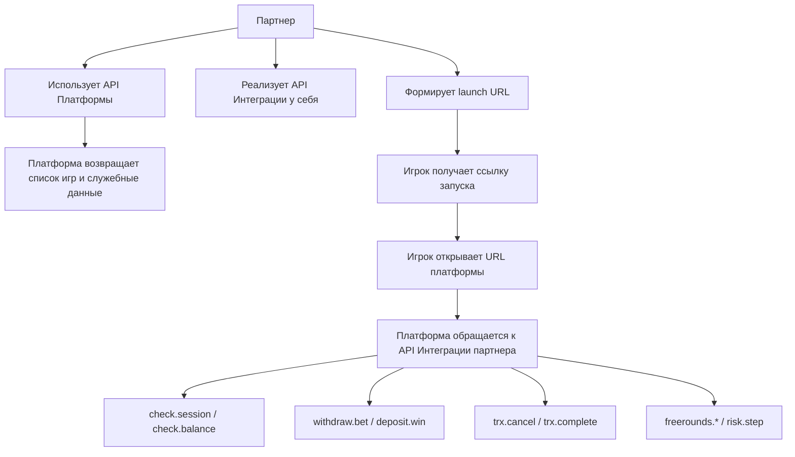
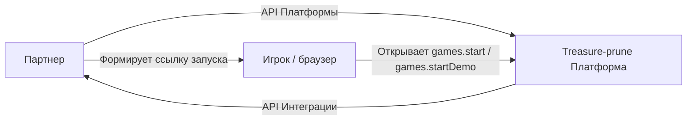
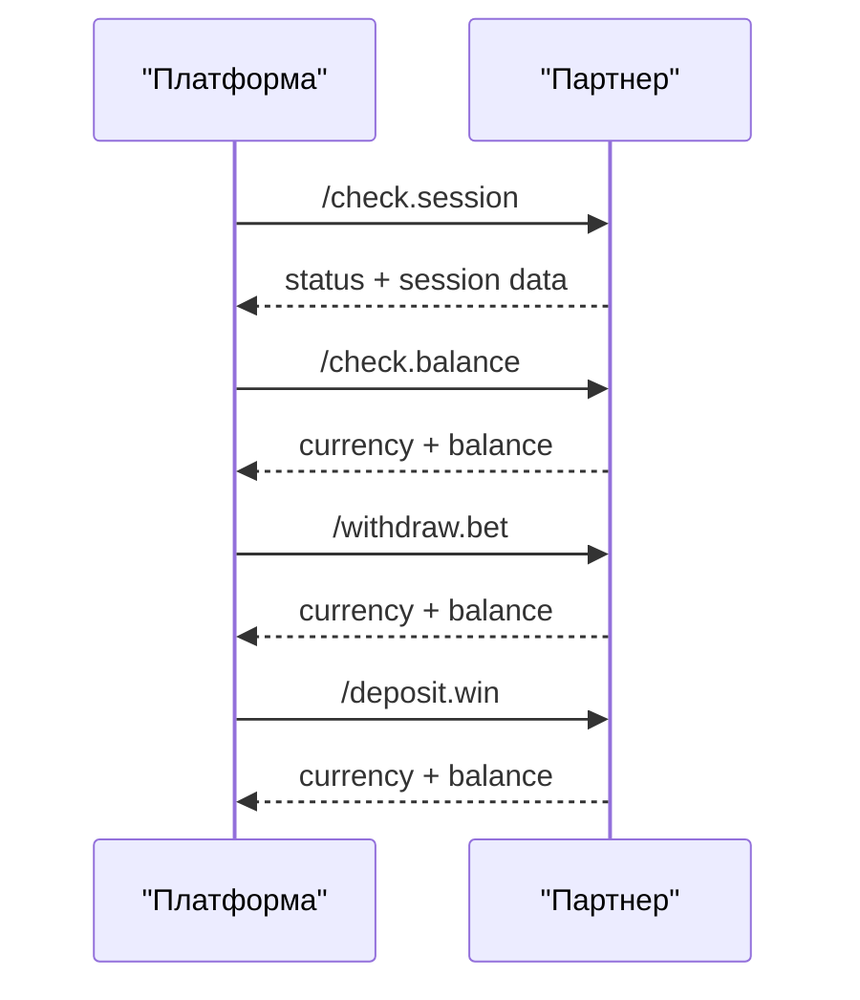
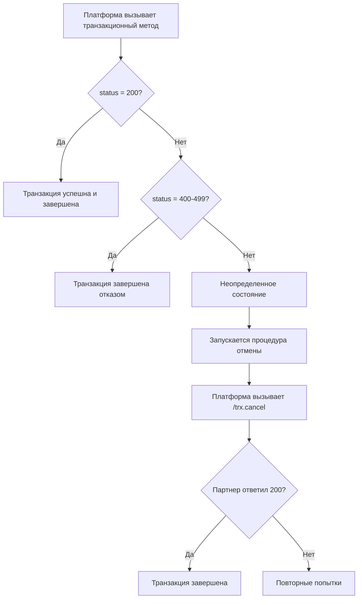
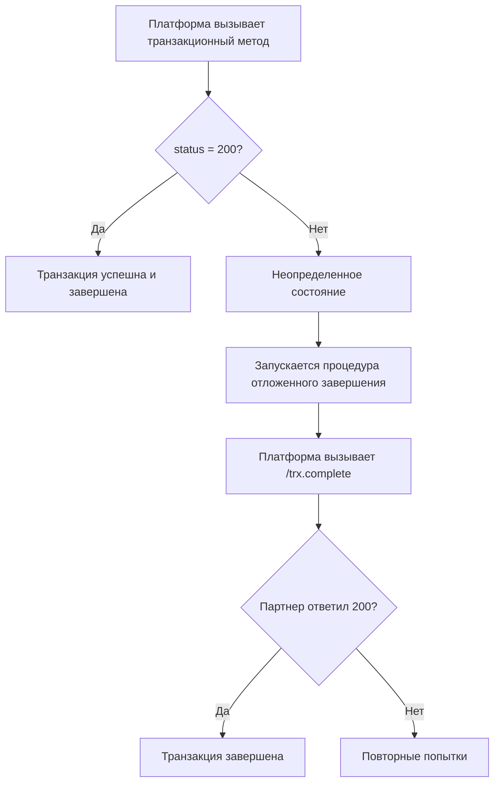
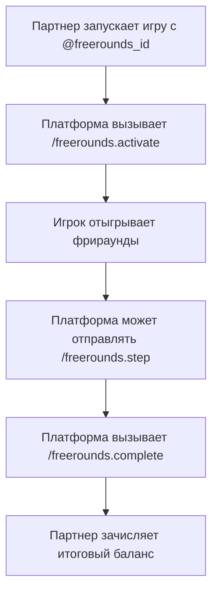

# API Treasure-prune

> Документ составлен **только** по файлу `API_Treasure-prune_source.md`, который был собран из пользовательских скриншотов первоисточника.
>
> Если в исходном материале нет достаточных данных для точного вывода, это **прямо помечено** в тексте как `Недостаточно данных в исходнике`.

## Оглавление

- [1. О документе и источнике](#1-о-документе-и-источнике)
- [2. Общая модель API](#2-общая-модель-api)
- [3. Термины и подключение](#3-термины-и-подключение)
- [4. API Платформы](#4-api-платформы)
- [5. API Интеграции](#5-api-интеграции)
- [6. Запуск игр](#6-запуск-игр)
- [7. Схемы взаимодействия и прохождения транзакций](#7-схемы-взаимодействия-и-прохождения-транзакций)
- [8. Что должен реализовать партнер на своей стороне](#8-что-должен-реализовать-партнер-на-своей-стороне)
- [9. Что в исходнике не раскрыто полностью](#9-что-в-исходнике-не-раскрыто-полностью)

---

## 1. О документе и источнике

Этот файл описывает API Treasure-prune на русском языке по внутреннему источнику:

- `API_Treasure-prune_source.md`

По исходнику видно, что документация разбита на 3 части:

1. `API Платформы`
2. `API Интеграции`
3. `Запуск игр`

Из того же источника следует такая общая модель:

- в `API Платформы` партнер сам отправляет запросы в сторону платформы;
- в `API Интеграции` уже сервер платформы вызывает методы на стороне партнера;
- в разделе `Запуск игр` описан способ генерации ссылок на запуск demo- и real-game-сессий.

---

## 2. Общая модель API

В исходнике описаны два разных направления обмена:

1. **Партнер -> Платформа**
   Используется `API Платформы`.
2. **Платформа -> Партнер**
   Используется `API Интеграции`.

Отдельно от этого есть блок `Запуск игр`, в котором описано:

- как сформировать ссылку для демо-игры;
- как сформировать ссылку для запуска на реальные средства;
- как передать `freerounds_id` при запуске фрираундов.

### 2.1. Общая схема работы



### 2.2. Что важно в модели Treasure-prune

По исходнику видно следующее:

- `API Платформы` использует `POST(HTTP)` и `application/x-www-form-urlencoded`;
- `API Интеграции` использует `POST(HTTP)` и JSON body;
- для методов `withdraw.bet` и `freerounds.activate` платформа применяет политику отмены при неопределенном результате;
- для методов `deposit.win` и `freerounds.complete` платформа применяет политику отложенного завершения;
- для этого существуют специальные контейнерные методы:
  - `/trx.cancel`
  - `/trx.complete`

Это означает, что в данном API важна не только сама денежная операция, но и ее судьба после таймаута, сетевой ошибки или неоднозначного ответа.

---

## 3. Термины и подключение

### 3.1. Термины

Ниже приведены термины так, как они даны в исходнике.

- `Платформа` - `...`
- `Партнер` - внешняя платформа, желающая подключиться к `Платформе`. Может быть представлена агрегатором игр или самостоятельным веб-сайтом, выполняющим интеграцию напрямую.
- `Личный кабинет` - в личном кабинете доступна дополнительная информация по подключению к платформе, а также остальные настройки, на которые может влиять партнер. Набор функций оговаривается для каждого конкретного партнера индивидуально.
- `Идентификатор партнера` - цифро-буквенная последовательность символов. В качестве букв могут использоваться только латинские буквы нижнего регистра. Формат: `([a-z][a-z0-9]{2,12})`
- `Секретный ключ` - используется для подписи запросов, где это необходимо.
- `Логин партнера` и `Пароль партнера` - используются для доступа в личный кабинет партнера.
- `Игрок` - человек, который запустил игру.

### 3.2. Подключение партнера к платформе

#### Предварительные шаги

1. Каждому партнеру присваивается идентификатор партнера, который оговаривается в устном порядке перед подключением к платформе.
2. Каждому партнеру выдается логин и пароль к личному кабинету.
3. Секретный ключ партнер может получить самостоятельно в личном кабинете.

#### Практические шаги

1. Партнер использует `API Платформы`.
2. Партнер реализует `API Интеграции` на своей стороне.
3. Партнер реализует отображение и запуск игр на своей стороне.

### 3.3. Что не раскрыто полностью

`Недостаточно данных в исходнике`:

- определение термина `Платформа` в источнике не раскрыто, вместо него стоит `...`;
- ссылки, указанные как `Ссылка`, в исходнике не раскрыты;
- не показан полный процесс выдачи тестовых и production-адресов.

---

## 4. API Платформы

В этом разделе партнер сам вызывает методы платформы.

### 4.1. Базовые правила

- `API.URI` - уточняется в технической поддержке.
- Все запросы выполняются в формате `POST(HTTP)`.
- URI формируется по схеме:
  - `API.URI + '/' + serviceName + '.' + methodName`
- Все параметры передаются в `application/x-www-form-urlencoded`.
- Все ответы платформа отдает в формате `JSON`.

### 4.2. Общая схема ответа

Положительный ответ:

```json
{
  "status": 200,
  "method": "service.method",
  "response": "...response entity as json..."
}
```

Отрицательный ответ:

```json
{
  "status": "Цифровой код отличный от 200",
  "method": "service.method",
  "message": "Строковое описание ошибки. В целях безопасности, описание не обязательно четко описывает, что произошло на сервере, но в некоторых случаях может служить подсказкой. В остальных случаях обратитесь в тех.поддержку."
}
```

### 4.3. HTTP status code

По исходнику:

- `Http Status Code` не является частью API;
- в успешных и неуспешных вызовах ожидается `200`;
- `Http Status Code`, отличный от `200`, трактуется как транспортная или серверная проблема, либо как полностью ошибочный запрос.

### 4.4. Общие параметры

Для всех методов передаются:

- `@partner.alias` - идентификатор партнера;
- `@partner.sign` - подпись, сформированная с использованием параметров запроса и секретного ключа.

В примерах подписи используются:

- `Идентификатор Партнера = test`
- `Секретный ключ = testsecret`

### 4.5. Формирование подписи

По исходнику подпись формируется так:

1. Берутся все параметры тела `POST`.
2. Исключаются параметры, чьи имена начинаются с:
   - `partner.`
   - `meta.`
3. Оставшиеся имена сортируются лексикографически.
4. Формируется строка вида `name=value&name=value`.
5. Затем считается:
   - `md5(joined + "&" + serviceName + "." + methodName + "&" + partnerAlias + "&" + secretKey)`

Псевдокод из исходника:

```scala
val params = Map[Name,Value]

val joined = names
  .filter( name => name.startsWith("partner.") == false && name.startsWith("meta.") == false)
  .sorted
  .map( name => name + "=" + params(name))
  .join("&")

val sign = md5(joined + "&" + serviceName + "." + methodName + "&" + "Идентификатор Партнера" + "&" + "Секретный Ключ")
```

### 4.6. Полный пример подписи

```text
METHOD: /games.list
PARAMS:
paramA = paramValueA
paramC = paramValueC
paramZ = paramValueZ
paramB = paramValueB
partner.alias = test
meta.param1 = someValue
meta.paramEtc = etcValue

SIGN:
// URL-encode - НЕ применяется
joined = "paramA=paramValueA&paramB=paramValueB&paramC=paramValueC&paramZ=paramValueZ"

stringToSign = joined + "&games.list&test&testsecret"
//stringToSign = "paramA=paramValueA&paramB=paramValueB&paramC=paramValueC&paramZ=paramValueZ&games.list&test&testsecret"

sign = md5(stringToSign)
//sign = "8cb94a439f507c1a6f9cede4982380a1"
```

### 4.7. Методы API Платформы

#### 4.7.1. `/games.list`

**Назначение**

Получение списка игр, доступных для партнера.

**Параметры**

- нет

**Подпись**

- не требуется

**Результат**

Массив объектов вида:

```json
{
  "id": 114,
  "alias": "Aloha",
  "group_alias": "slots",
  "title": "Aloha",
  "provider": "netent",
  "is_enabled": true,
  "desktop_enabled": true,
  "mobile_enabled": true
}
```

**Пример CURL**

```bash
curl -X POST -d "partner.alias=test&partner.sign=c0b8489e2655c6b21c2b9cb4d239634b" http://api.netent.local/games.list
```

**Пример ответа**

```json
{
  "method": "games.list",
  "status": 200,
  "response": [
    {
      "id": 114,
      "alias": "Aloha",
      "group_alias": "slots",
      "title": "Aloha",
      "provider": "netent",
      "is_enabled": true,
      "desktop_enabled": true,
      "mobile_enabled": true
    }
  ]
}
```

#### 4.7.2. `/netent.freeroundsInfo`

**Назначение**

Получение краткой информации о состоянии фрираунда.

**Параметры**

- `@partner.alias` - `String`
- `@freerounds_id` - `String`

**Подпись**

- не требуется

**Результат**

```json
{
  "max_step": "Int",
  "steps": "Int",
  "steps_last_win": "Long",
  "total_win": "Long"
}
```

### 4.8. Что важно учитывать по API Платформы

- подпись здесь используется не всегда;
- в подписи не участвуют `partner.*` и `meta.*`;
- исходник допускает передачу дополнительных `meta.*` полей;
- URL методов строится динамически через `serviceName.methodName`, а не перечислен единым списком базовых REST-маршрутов.

---

## 5. API Интеграции

В этом разделе уже платформа вызывает методы на стороне партнера.

Исходник прямо говорит:

- игровой сервер использует это API для взаимодействия с сервером партнера;
- партнер должен реализовать обработку этих запросов и отдачу соответствующих ответов.

### 5.1. Базовые правила

- `API.URI` - адрес, который партнер должен сообщить менеджеру;
- все запросы выполняются в формате `POST(HTTP)`;
- `URI` формируется по схеме:
  - `API.URI + '/' + serviceName + '.' + methodName`
- в теле запроса передается JSON object;
- запросы подписываются с использованием секретного ключа, если не указано иное.

### 5.2. Подпись во входящих запросах

По исходнику:

- подпись может использоваться партнером, чтобы убедиться, что запрос пришел от платформы;
- в подписи участвуют только поля первого уровня, значения которых являются примитивами;
- в подписи не участвуют поля:
  - `partner`
  - `meta`

Из того же исходника следует:

- `meta` содержит дополнительную информацию;
- на формат `meta` не рекомендуется жестко завязываться;
- для статических данных лучше использовать партнерское API или доступ в личный кабинет.

### 5.3. Общая схема ответа

Положительный ответ:

```json
{
  "status": 200,
  "method": "service.method",
  "response": "...response entity as json..."
}
```

Отрицательный ответ:

```json
{
  "status": "Цифровой код отличный от 200",
  "method": "service.method",
  "message": "Строковое описание ошибки. В целях безопасности, описание не обязательно четко описывает, что произошло на сервере, но в некоторых случаях может служить подсказкой. В остальных случаях обратитесь в тех.поддержку."
}
```

### 5.4. Таймауты и базовая обработка ошибок

Общая информация из исходника:

- `Connect timeout = 1s`
- `Read timeout = 3s`
- при любых ошибках при общении с сервером партнера клиенту в игру отправляется ошибка;
- игра требует перезагрузки для продолжения.

### 5.5. Политики обработки

#### 5.5.1. `Stop on fail`

Методы:

- `check.session`
- `check.balance`

Поведение:

- при любой ошибке происходит остановка.

#### 5.5.2. `Cancel on undefined behavior`

Методы:

- `withdraw.bet`
- `freerounds.activate`

Поведение:

- если `status = 200`, транзакция считается успешной и завершенной;
- если `status = 400-499`, транзакция считается завершенной отказной;
- если пришел любой другой код, запускается процедура отмены;
- если ответа нет вообще, также запускается процедура отмены.

Процедура отмены:

1. Транзакция помечается как отмененная и не завершенная.
2. Платформа делает несколько попыток сообщить об отмене через `trx.cancel`.
3. Если партнер отвечает `200`, транзакция считается завершенной.
4. Если партнер отвечает не `200`, попытки продолжаются.

#### 5.5.3. `Proceed on fail`

Методы:

- `deposit.win`
- `freerounds.complete`

Поведение:

- если `status = 200`, транзакция считается успешной и завершенной;
- если пришел любой другой код, запускается процедура отложенного завершения;
- если ответа нет вообще, тоже запускается процедура отложенного завершения.

Процедура отложенного завершения:

1. Транзакция помечается как не завершенная.
2. Платформа делает несколько попыток сообщить о завершении через `trx.complete`.
3. Если партнер отвечает `200`, транзакция считается завершенной.
4. Если партнер отвечает не `200`, попытки продолжаются.

### 5.6. Методы API Интеграции

#### 5.6.1. `/trx.cancel`

**Назначение**

Отмена транзакции.

**Параметры**

- `@cmd` - метод, который ранее использовался для проведения транзакции;
- `@body` - JSON body исходного запроса, который ранее был отправлен партнеру.

**Особенность**

Это контейнерный запрос. Для него не требуется обычная проверка подписи по внешней схеме. При этом партнер может отдельно проверить подпись внутри `@body`, как если бы это был обычный самостоятельный запрос.

**Результат**

```json
{
  "cmd": "trx.cancel",
  "status": 200
}
```

`Недостаточно данных в исходнике`:

- заголовок `Пример запроса который отправляет Платформа` в источнике есть, но тело примера на скриншотах отсутствует.

#### 5.6.2. `/trx.complete`

**Назначение**

Завершение транзакции.

**Параметры**

- `@cmd` - метод, который ранее использовался для проведения транзакции;
- `@body` - JSON body исходного запроса, который ранее был отправлен партнеру.

**Особенность**

Это контейнерный запрос. Для него также не требуется обычная внешняя проверка подписи; при необходимости можно проверить подпись содержимого `@body`.

**Результат**

```json
{
  "cmd": "trx.complete",
  "status": 200
}
```

**Пример запроса**

```json
{
  "cmd": "deposit.win",
  "body": {
    "sign": "SSSS",
    "session": "PARTNERSESSIONID",
    "currency": "RUB",
    "amount": 5,
    "trx_id": "123456",
    "round_id": 123,
    "meta": {
      "tag": {
        "game": "slot",
        "game_id": 493,
        "round_id": 123,
        "bet": 20,
        "denomination": 1
      }
    },
    "partner.alias": "somepartner"
  }
}
```

`Недостаточно данных в исходнике`:

- в примере выше поле `cmd` содержит `deposit.win`, хотя сам раздел посвящен `/trx.complete`;
- по исходнику нельзя надежно утверждать, было ли это сокращение примера, ошибка в документе или неполный скриншот.

#### 5.6.3. `/check.session`

**Назначение**

Получение или проверка информации о сессии на стороне партнера.

**Параметры**

- `@session` - идентификатор сессии игрока, указанный партнером при старте игры;
- `@currency` - 3-letter код валюты, указанный при старте игры;
- `@game_id` - ID игры, указанный при старте игры.

**Результат**

```json
{
  "id_player": "Long|String",
  "id_group": "Int|String",
  "balance": "Long"
}
```

`Недостаточно данных в исходнике`:

- заголовок `Пример запроса` присутствует, но сам пример на скриншотах отсутствует.

#### 5.6.4. `/check.balance`

**Назначение**

Получение информации о балансе на стороне партнера.

**Параметры**

- `@session` - идентификатор сессии игрока;
- `@currency` - 3-letter код валюты;
- `@game_id` - `Int`.

Источник отдельно уточняет:

- партнер может показывать разный баланс для разных игр;
- пример: в одних играх используется бонусный счет, а в других нет.

**Результат**

```json
{
  "currency": "String",
  "balance": "Long"
}
```

#### 5.6.5. `/withdraw.bet`

**Назначение**

Списание с баланса за совершение ставки.

**Параметры**

- `@session` - идентификатор сессии игрока;
- `@currency` - 3-letter код валюты;
- `@amount` - сумма в minor units по ISO 4217;
- `@trx_id` - уникальный идентификатор транзакции на стороне платформы.

Источник отдельно требует:

- партнер должен обеспечивать проверку уникальности `@trx_id`;
- повторный запрос с тем же `@trx_id` не должен приводить к повторному списанию.

**Результат**

```json
{
  "currency": "String",
  "balance": "Long"
}
```

`Недостаточно данных в исходнике`:

- заголовок `Пример запроса который отправляет Платформа` есть, но сам body примера отсутствует.

#### 5.6.6. `/deposit.win`

**Назначение**

Зачисление выигрыша на баланс.

**Параметры**

- `@session` - идентификатор сессии игрока;
- `@currency` - 3-letter код валюты;
- `@amount` - сумма в minor units по ISO 4217;
- `@trx_id` - уникальный идентификатор транзакции на стороне платформы.

В исходнике для `@trx_id` повторяется то же требование:

- партнер должен проверять уникальность;
- повторный вызов с тем же `@trx_id` не должен приводить к повторной обработке.

**Результат**

```json
{
  "currency": "String",
  "balance": "Long"
}
```

#### 5.6.7. `/freerounds.activate`

**Назначение**

Активация фрираундов.

**Параметры**

- `@session`
- `@currency`
- `@game_id`
- `@freerounds_id`
- `@trx_id`

Источник уточняет:

- `@freerounds_id` должен быть уникальным для конкретного игрока;
- партнер может дополнительно ограничивать список игр, где допускаются конкретные фрираунды.

**Результат**

```json
{
  "total": "Int",
  "currency": "String",
  "betlevel": "Int",
  "rate": "Int"
}
```

#### 5.6.8. `/freerounds.complete`

**Назначение**

Завершение фрираундов.

**Параметры**

- `@session`
- `@currency`
- `@freerounds_id`
- `@trx_id`
- `@total_win`

**Результат**

```json
{
  "currency": "String",
  "balance": "Long"
}
```

#### 5.6.9. `/freerounds.step`

**Назначение**

Уведомление о завершении шага фрираунда.

Источник отдельно подчеркивает:

- это **не транзакционное** действие;
- его **нельзя** использовать для изменения баланса игрока;
- запросы в случае ошибок **не дублируются**.

**Параметры**

- `@session`
- `@freerounds_id`
- `@step`
- `@step_win`
- `@total_win`

**Результат**

```json
true
```

#### 5.6.10. `/risk.step`

**Назначение**

Уведомление о совершении шага риска.

Источник отдельно подчеркивает:

- это **не транзакционное** действие;
- его **нельзя** использовать для изменения баланса игрока;
- запросы в случае ошибок **не дублируются**.

**Пример payload**

```json
{
  "sign": "796aa918ad99423665446add007b730e",
  "session": "5e72f285-3497-43aa-914b-f80aae5cbcbe",
  "id_player": "1111",
  "id_round": 111,
  "is_round_ended": true,
  "id_game": 293,
  "risk_index": 0,
  "risk_step": 1,
  "risk_first_bet": 150,
  "risk_bet": 1500,
  "risk_win": 0,
  "currency": "RUB",
  "partner.alias": "test"
}
```

`Недостаточно данных в исходнике`:

- ответ для `/risk.step` в исходнике не показан;
- не раскрыт полный перечень значений `risk_index`, `risk_step` и связанных полей.

### 5.7. Механика freerounds по исходнику

Источник описывает следующий порядок:

1. Партнер запускает игру как обычно и добавляет `@freerounds_id`.
2. Платформа активирует фрираунды на сервере партнера.
3. Игрок отыгрывает фрираунды.
4. Во время фрираундов выигрыши не зачисляются на сервер партнера.
5. Платформа завершает фрираунды на сервере партнера и передает общий выигрыш.

---

## 6. Запуск игр

### 6.1. Доступные языки

По исходнику доступны 24 языка. Значение по умолчанию: `en`.

- `bg` - Bulgarian
- `br` - Portuguese (Brazil)
- `cn` - Chinese (Simplified)
- `cs` - Czech
- `da` - Danish
- `de` - German
- `el` - Greek
- `en` - English
- `es` - Spanish
- `et` - Estonian
- `fi` - Finnish
- `fr` - French
- `hr` - Croatian
- `hu` - Hungarian
- `it` - Italian
- `nl` - Dutch
- `no` - Norwegian
- `pl` - Polish
- `pt` - Portuguese
- `ro` - Romanian
- `ru` - Russian
- `sk` - Slovak
- `sv` - Swedish
- `tr` - Turkish

Дополнительные языки требуют перевода.

### 6.2. Доступные валюты

По исходнику:

- `Национальные:` 164 валюты согласно ISO 4217
- `Дополнительные:` `BTC,uBTC,mBTC,ETH,mETH,uETH,LTC,mLTC,uLTC`

`Недостаточно данных в исходнике`:

- полный список валют указан как `Ссылка`, но сама ссылка в исходнике не раскрыта.

### 6.3. Запуск демо

Для демо-режима в исходнике показана генерация ссылки запуска.

**Параметры**

- `partner.alias:String`
- `game.provider:String`
- `game.alias:String`
- `currency:String`
- `mobile:bool` - optional, default=`false`
- `lang:String` - optional, default=`en`
- `lobby_url:String` - optional
- `balance:Integer` - optional, default=`500000`
- `button_exit_show:bool` - optional

**Пример**

```text
https://test.partners.casinomobule.com/games.startDemo?partner.alias=somepartner&game.provider=playngo&game.alias=reactoonz&currency=USD
```

### 6.4. Запуск на реальные средства

Для real-money режима в исходнике также показана генерация ссылки запуска.

**Параметры**

- `partner.alias:String`
- `partner.session:String`
- `game.provider:String`
- `game.alias:String`
- `mobile:bool` - optional, default=`false`
- `lang:String` - optional, default=`en`
- `lobby_url:String` - optional
- `button_exit_show:bool` - optional

**Пример**

```text
https://test.partners.casinomobule.com/games.start?partner.alias=somepartner&partner.session=SOME_SESSION_ID_ON_PARTNER_SIDE&game.provider=playngo&game.alias=reactoonz
```

### 6.5. Запуск фрираундов

При запуске фрираундов добавляется параметр:

- `@freerounds_id:String` - `UNIQUE` в рамках `partner.alias`

Источник прямо отсылает за подробностями к разделу `API Интеграции`.

---

## 7. Схемы взаимодействия и прохождения транзакций

### 7.1. Общая схема направлений вызовов



Правильная трактовка этой схемы по исходнику такая:

1. Партнер обращается к платформе через `API Платформы`.
2. Партнер формирует ссылку запуска игры.
3. Игрок или браузер игрока открывает эту ссылку.
4. Эта ссылка указывает на endpoint платформы:
   - `games.startDemo`
   - `games.start`
5. Уже после запуска игры платформа вызывает `API Интеграции` на стороне партнера.

### 7.2. Базовый сценарий ставки и выигрыша

Ниже показана только та последовательность, которая прямо следует из исходника:



`Недостаточно данных в исходнике`:

- источник не утверждает, что `check.session` и `check.balance` вызываются строго перед каждой ставкой;
- схема выше показывает только логически допустимую последовательность методов, исходя из их назначения.

### 7.3. Сценарий `Cancel on undefined behavior`

Этот сценарий в исходнике прямо относится к:

- `withdraw.bet`
- `freerounds.activate`



### 7.4. Сценарий `Proceed on fail`

Этот сценарий в исходнике прямо относится к:

- `deposit.win`
- `freerounds.complete`



### 7.5. Сценарий freerounds



### 7.6. Что означают `trx.cancel` и `trx.complete`

По исходнику:

- `trx.cancel` нужен, чтобы платформа могла отдельно сообщить партнеру об отмене ранее начатой транзакции;
- `trx.complete` нужен, чтобы платформа могла отдельно сообщить партнеру о завершении ранее начатой транзакции;
- оба метода являются контейнерами и несут исходный запрос в поле `@body`.

Это означает, что в данном API важна не только обработка самого `withdraw.bet` или `deposit.win`, но и корректная обработка их последующей судьбы при сбое связи или неоднозначном ответе.

---

## 8. Что должен реализовать партнер на своей стороне

Если опираться только на исходник, партнеру нужно реализовать следующее.

### 8.1. Для подключения

- получить `partner.alias`;
- получить доступ в личный кабинет;
- получить секретный ключ;
- сообщить платформе `API.URI` для входящих вызовов.

### 8.2. Для `API Платформы`

- уметь формировать `POST` запросы в `application/x-www-form-urlencoded`;
- уметь собирать подпись `md5(...)` по правилам исходника;
- уметь вызывать как минимум:
  - `/games.list`
  - `/netent.freeroundsInfo`

### 8.3. Для `API Интеграции`

- принимать `POST` запросы с JSON body;
- проверять подпись по полям первого уровня;
- реализовать методы:
  - `/check.session`
  - `/check.balance`
  - `/withdraw.bet`
  - `/deposit.win`
  - `/trx.cancel`
  - `/trx.complete`
  - `/freerounds.activate`
  - `/freerounds.complete`
  - `/freerounds.step`
  - `/risk.step`
- корректно соблюдать разные политики обработки:
  - `Stop on fail`
  - `Cancel on undefined behavior`
  - `Proceed on fail`
- обеспечивать защиту от повторной обработки `@trx_id`.

### 8.4. Для запуска игр

- формировать demo-link;
- формировать real-money-link;
- при необходимости передавать `@freerounds_id`.

---

## 9. Что в исходнике не раскрыто полностью

Ниже перечислено то, чего в исходнике недостаточно для точного технического вывода.

### 9.1. Базовый адрес API

`API.URI` указан как:

- уточняйте в техподдержке;
- не забудьте сообщить менеджеру адрес.

То есть конкретный host/base URL в исходнике отсутствует.

### 9.2. Определение термина `Платформа`

В блоке терминов стоит:

- `Платформа - ...`

Поэтому точное определение в исходнике не раскрыто.

### 9.3. Ссылки на связанные разделы

В исходнике встречаются ссылки-заглушки:

- `Ссылка`

Но сами URL в предоставленном материале отсутствуют.

### 9.4. Примеры запросов

В нескольких местах видны только заголовки `Пример запроса`, но сами request bodies на скриншотах отсутствуют. Это касается как минимум:

- `/trx.cancel`
- `/check.session`
- `/withdraw.bet`

### 9.5. Точное число "основных" методов в API Интеграции

В одном месте источник говорит:

- "на данный момент это 4 метода"

Но дальше в том же документе перечислены:

- транзакционные методы;
- контейнерные методы `trx.cancel` и `trx.complete`;
- `freerounds.*`;
- `risk.step`.

Без дополнительных данных нельзя точно утверждать, что имелось в виду под "4 метода":

- только базовые игровые методы;
- или полный обязательный набор на старте;
- или только те вызовы, которые используются игровым сервером в основной ветке.

### 9.6. Ответ для `/risk.step`

Пример payload есть, но формат ответа в исходнике не показан.

### 9.7. Полный список валют

Сказано:

- 164 национальные валюты;
- перечислены дополнительные криптовалютные единицы;
- полный список валют вынесен в отдельную ссылку.

Но сама ссылка в исходнике отсутствует.
