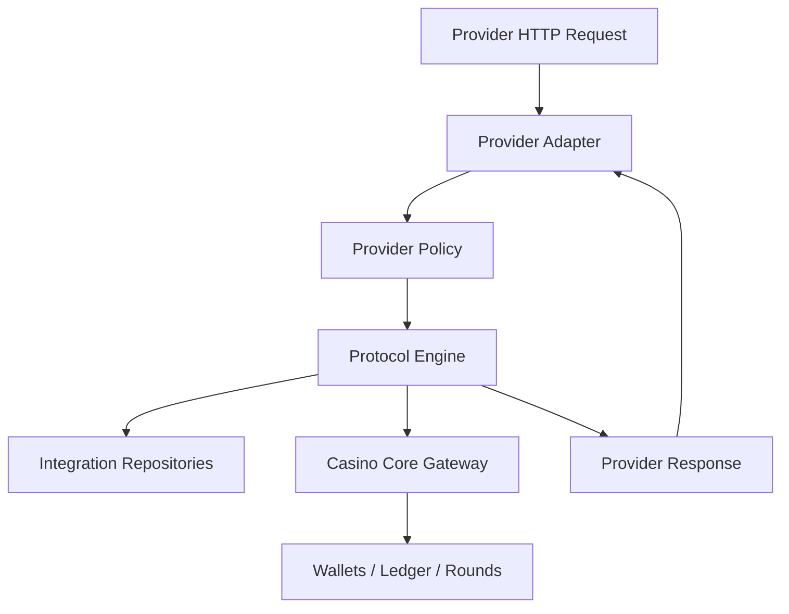
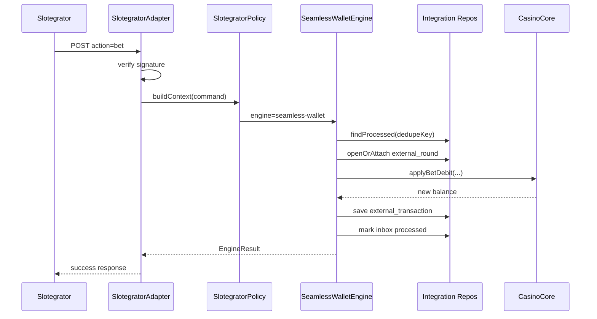
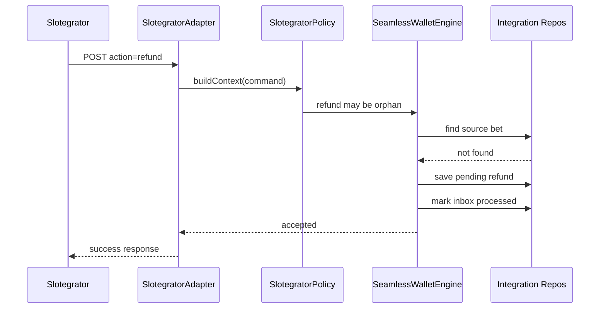
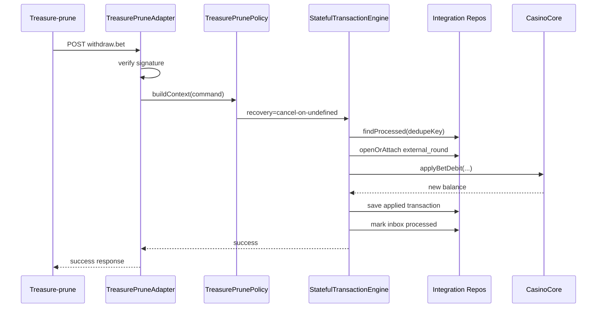
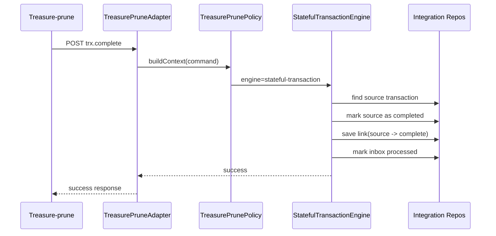

# Пример Слоистой Архитектуры Интеграций

Этот документ показывает **упрощенный, но уже похожий на реальный код** пример архитектуры из `README`.

Цель:

- показать слои;
- показать минимальные классы и интерфейсы;
- показать таблицы;
- показать, как идут вызовы во время игры;
- не усложнять модель лишними деталями.

---

## 1. Слои

Используем 5 слоев:

1. `Provider Adapter`
2. `Provider Policy`
3. `Protocol Engine`
4. `Integration Platform`
5. `Casino Core`

Простыми словами про каждый слой:

- `Provider Adapter`
  Это самый внешний слой. Он принимает запрос провайдера в том виде, в котором тот реально пришел по HTTP.
  Его задача:
  - проверить подпись;
  - прочитать поля из body и headers;
  - привести их к внутреннему понятному формату;
  - собрать ответ обратно в формат провайдера.
  Маленький пример:
  пришел `action=bet` от Slotegrator с `transaction_id`, `round_id`, `amount`.
  Adapter не решает, можно ли списывать деньги. Он просто говорит системе:
  "Вот нормализованная команда `bet`, вот ее id, round, amount и currency".

- `Provider Policy`
  Это слой правил конкретного провайдера.
  Здесь лежит не формат запроса, а договоренность "как именно трактовать поведение этого провайдера".
  Его задача:
  - выбрать нужный engine;
  - сказать, по чему лучше искать round;
  - сказать, может ли событие прийти раньше связанной операции;
  - описать provider-specific особенности.
  Маленький пример:
  для Slotegrator policy знает, что `refund` может прийти раньше исходной `bet`, а round безопаснее искать прежде всего по `round_id`.
  Для Treasure-prune policy знает, что после `withdraw.bet` может прийти отдельный `trx.cancel` или `trx.complete`.

- `Protocol Engine`
  Это слой общей логики.
  Он уже не думает про конкретный HTTP-формат, но знает, как в целом обрабатывать семейство похожих API.
  Его задача:
  - защититься от дублей;
  - решить, нужно ли открыть round;
  - понять, надо ли положить событие в pending;
  - вызвать core для реального движения денег;
  - сохранить итог обработки.
  Маленький пример:
  `SeamlessWalletEngine` получает команду `refund`.
  Он сначала ищет исходную `bet`.
  Если `bet` еще нет, engine не падает и не двигает деньги, а кладет refund в `pending_operations`.

- `Integration Platform`
  Это место, где живет внешнее состояние интеграции.
  Здесь мы храним все, что относится не к самим деньгам казино, а к общению с провайдером.
  Его задача:
  - хранить входящие запросы и результаты их обработки;
  - хранить внешние транзакции;
  - хранить связь внешнего round с внутренним round;
  - хранить pending и связи между событиями.
  Маленький пример:
  если тот же `bet` пришел второй раз, именно здесь система найдет,
  что такой запрос уже обрабатывался, и вернет прежний результат,
  не списывая деньги повторно.

- `Casino Core`
  Это уже внутренняя денежная часть казино.
  Здесь нет логики разбора callback-форматов провайдера.
  Здесь есть только нормальные внутренние операции: списать ставку, начислить выигрыш, сделать refund, записать проводку.
  Его задача:
  - изменить баланс;
  - записать движение денег в ledger;
  - обновить состояние игрового round.
  Маленький пример:
  engine вызывает `applyBetDebit`.
  Core создает debit-запись в `ledger_entries`, уменьшает баланс в `wallets` и привязывает это списание к внутреннему round.

---

## 2. Общая схема



---

## 3. Пример классов

### 3.1. Provider Adapter

```ts
/**
 * Adapter - это самый внешний слой.
 * Он принимает запрос от провайдера, проверяет его и превращает
 * "сырой" HTTP payload в понятную внутреннюю команду.
 *
 * Важная мысль:
 * adapter не решает, можно ли списывать деньги, делать refund или
 * как обрабатывать дубли. Он только готовит данные для следующих слоев.
 */
export interface ProviderAdapter {
  providerCode: string;

  verify(request: HttpRequest): void;
  parse(request: HttpRequest): ProviderCommand;
  formatSuccess(result: EngineResult): HttpResponse;
  formatError(error: EngineError): HttpResponse;
}

/**
 * SlotegratorAdapter знает, как именно выглядит запрос Slotegrator.
 *
 * Он:
 * - проверяет подпись;
 * - читает поля из form-data;
 * - собирает из них внутреннюю команду.
 *
 * Он не должен сам искать round, проверять duplicate или двигать деньги.
 */
export class SlotegratorAdapter implements ProviderAdapter {
  providerCode = "slotegrator";

  verify(request: HttpRequest): void {
    // check X-Merchant-Id, X-Timestamp, X-Nonce, X-Sign
  }

  parse(request: HttpRequest): ProviderCommand {
    // action=balance|bet|win|refund|rollback -> normalized command
    return {
      provider: "slotegrator",
      type: "bet",
      externalTransactionId: request.body.transaction_id,
      externalRoundId: request.body.round_id,
      externalSessionId: request.body.session_id,
      amount: request.body.amount,
      currency: request.body.currency,
      raw: request.body,
    };
  }

  formatSuccess(result: EngineResult): HttpResponse {
    return { status: 200, body: result.responseBody };
  }

  formatError(error: EngineError): HttpResponse {
    return { status: 200, body: error.responseBody };
  }
}

/**
 * TreasurePruneAdapter делает ту же работу, но для Treasure-prune.
 *
 * Разница только в формате входящего запроса и в названиях полей.
 * Смысл слоя остается тем же: принять запрос и подготовить команду.
 */
export class TreasurePruneAdapter implements ProviderAdapter {
  providerCode = "treasure-prune";

  verify(request: HttpRequest): void {
    // verify signature for incoming JSON request
  }

  parse(request: HttpRequest): ProviderCommand {
    return {
      provider: "treasure-prune",
      type: request.body.cmd,
      externalTransactionId: request.body.transaction_id,
      externalRoundId: request.body.round_id,
      externalSessionId: request.body.session_id,
      amount: request.body.amount,
      currency: request.body.currency,
      raw: request.body,
    };
  }

  formatSuccess(result: EngineResult): HttpResponse {
    return { status: 200, body: result.responseBody };
  }

  formatError(error: EngineError): HttpResponse {
    return { status: 200, body: error.responseBody };
  }
}
```

### 3.2. Provider Policy

```ts
/**
 * Policy - это место для правил конкретного провайдера.
 *
 * Здесь мы держим то, что уже не похоже просто на "разбор запроса",
 * но еще не должно раздувать общий engine.
 *
 * Проще говоря:
 * policy отвечает на вопрос "как именно этот провайдер ожидает,
 * что мы будем трактовать его события".
 */
export interface ProviderPolicy {
  providerCode: string;

  resolveEngine(command: ProviderCommand): EngineKind;
  buildContext(command: ProviderCommand): ProviderContext;
}

/**
 * В SlotegratorPolicy лежат простые правила работы именно со Slotegrator.
 *
 * Например:
 * - как лучше искать нужный round;
 * - можно ли принять событие раньше исходной ставки;
 * - какой тайм-аут у callback-контура.
 */
export class SlotegratorPolicy implements ProviderPolicy {
  providerCode = "slotegrator";

  resolveEngine(command: ProviderCommand): EngineKind {
    return "seamless-wallet";
  }

  buildContext(command: ProviderCommand): ProviderContext {
    return {
      // По этому ключу engine проверяет duplicate и повторно отдает сохраненный результат.
      dedupeKey: `${command.provider}:${command.type}:${command.externalTransactionId}`,
      // Для Slotegrator безопаснее матчить события прежде всего по round_id.
      roundMatchStrategy: "round_id-first",
      // Refund может прийти раньше source bet, это нормальный сценарий.
      canArriveBeforeSource: command.type === "refund",
      callbackTimeoutSeconds: 3,
    };
  }
}

/**
 * TreasurePrunePolicy описывает, как Treasure-prune ведет себя при сбоях.
 *
 * Это важно, потому что этот провайдер не только шлет денежные события,
 * но и отдельно управляет их дальнейшей судьбой через cancel/complete.
 */
export class TreasurePrunePolicy implements ProviderPolicy {
  providerCode = "treasure-prune";

  resolveEngine(command: ProviderCommand): EngineKind {
    return "stateful-transaction";
  }

  buildContext(command: ProviderCommand): ProviderContext {
    return {
      dedupeKey: `${command.provider}:${command.type}:${command.externalTransactionId}`,
      recoveryMode:
        command.type === "withdraw.bet"
          ? "cancel-on-undefined"
          : command.type === "deposit.win"
            ? "complete-on-fail"
            : "none",
      callbackTimeoutSeconds: 3,
    };
  }
}
```

### 3.3. Protocol Engine

```ts
/**
 * Engine - это сердце обработки.
 *
 * Именно здесь живет общая бизнес-логика семейства протоколов:
 * - защита от повторов;
 * - порядок шагов;
 * - работа с pending;
 * - переходы состояний внешней транзакции.
 *
 * Если adapter отвечает за форму запроса,
 * то engine отвечает уже за смысл обработки.
 */
export interface ProtocolEngine {
  kind: EngineKind;
  handle(command: ProviderCommand, context: ProviderContext): Promise<EngineResult>;
}

/**
 * SeamlessWalletEngine подходит для провайдеров,
 * которые ходят к нам за балансом, ставкой, выигрышем и refund.
 *
 * Он не знает конкретно Slotegrator или другого вендора.
 * Он знает общий сценарий такого семейства API.
 */
export class SeamlessWalletEngine implements ProtocolEngine {
  kind: EngineKind = "seamless-wallet";

  constructor(
    private inboxRepo: IntegrationInboxRepository,
    private txRepo: ExternalTransactionRepository,
    private roundRepo: ExternalRoundRepository,
    private pendingRepo: PendingOperationRepository,
    private core: CasinoCoreGateway,
  ) {}

  async handle(command: ProviderCommand, context: ProviderContext): Promise<EngineResult> {
    // Если этот запрос уже был обработан, деньги второй раз двигать нельзя.
    const duplicate = await this.inboxRepo.findProcessed(context.dedupeKey);
    if (duplicate) return duplicate.savedResult;

    if (command.type === "bet") {
      // Сначала привязываем provider event к round, потом двигаем деньги.
      const round = await this.roundRepo.openOrAttach(command);
      const money = await this.core.applyBetDebit({
        playerId: command.playerId!,
        amount: command.amount!,
        currency: command.currency!,
        roundId: round.internalRoundId,
      });

      const result = { ok: true, balance: money.balance };
      // Сохраняем и внешний эффект, и canonical response для duplicate replay.
      await this.txRepo.saveApplied(command, round, result);
      await this.inboxRepo.markProcessed(context.dedupeKey, result);
      return result;
    }

    if (command.type === "refund") {
      const sourceBet = await this.txRepo.findSourceBet(command);
      if (!sourceBet) {
        const result = { ok: true, accepted: true };
        // Важный case: refund пока не к чему привязать, поэтому кладем его в pending.
        await this.pendingRepo.save(command);
        await this.inboxRepo.markProcessed(context.dedupeKey, result);
        return result;
      }

      const money = await this.core.applyRefund({
        playerId: sourceBet.playerId,
        amount: sourceBet.amount,
        currency: sourceBet.currency,
        roundId: sourceBet.internalRoundId,
      });

      const result = { ok: true, balance: money.balance };
      // Refund уже привязан к source bet, теперь можно сохранить обратную связь.
      await this.txRepo.saveRefund(command, sourceBet, result);
      await this.inboxRepo.markProcessed(context.dedupeKey, result);
      return result;
    }

    throw new Error(`Unsupported seamless command: ${command.type}`);
  }
}

/**
 * StatefulTransactionEngine нужен там, где после основной денежной операции
 * может прийти отдельная команда вроде complete или cancel.
 *
 * Его задача - помнить судьбу внешней транзакции и не двигать деньги повторно,
 * если пришел recovery-вызов.
 */
export class StatefulTransactionEngine implements ProtocolEngine {
  kind: EngineKind = "stateful-transaction";

  constructor(
    private inboxRepo: IntegrationInboxRepository,
    private txRepo: ExternalTransactionRepository,
    private roundRepo: ExternalRoundRepository,
    private core: CasinoCoreGateway,
  ) {}

  async handle(command: ProviderCommand, context: ProviderContext): Promise<EngineResult> {
    // Одинаковое правило: duplicate не должен создавать второй money-effect.
    const duplicate = await this.inboxRepo.findProcessed(context.dedupeKey);
    if (duplicate) return duplicate.savedResult;

    if (command.type === "withdraw.bet") {
      const round = await this.roundRepo.openOrAttach(command);
      const money = await this.core.applyBetDebit({
        playerId: command.playerId!,
        amount: command.amount!,
        currency: command.currency!,
        roundId: round.internalRoundId,
      });

      const result = { ok: true, balance: money.balance };
      await this.txRepo.saveApplied(command, round, result);
      await this.inboxRepo.markProcessed(context.dedupeKey, result);
      return result;
    }

    if (command.type === "trx.complete") {
      // complete должен обновлять судьбу внешней транзакции, а не заново списывать/начислять деньги.
      const source = await this.txRepo.findSourceTransaction(command);
      const result = { ok: true, completed: true, sourceId: source?.externalTransactionId };
      await this.txRepo.markCompleted(command, source, result);
      await this.inboxRepo.markProcessed(context.dedupeKey, result);
      return result;
    }

    throw new Error(`Unsupported stateful command: ${command.type}`);
  }
}
```

### 3.4. Integration Platform

```ts
/**
 * Inbox нужен, чтобы переживать повторы одного и того же запроса.
 *
 * Если провайдер прислал тот же callback еще раз,
 * мы не должны второй раз списывать или начислять деньги.
 * Вместо этого мы находим сохраненный результат и возвращаем его повторно.
 */
export interface IntegrationInboxRepository {
  findProcessed(dedupeKey: string): Promise<{ savedResult: EngineResult } | null>;
  markProcessed(dedupeKey: string, result: EngineResult): Promise<void>;
}

/**
 * Репозиторий внешних транзакций хранит все,
 * что относится к внешним операциям провайдера.
 *
 * Здесь лежит ответ на вопросы:
 * - была ли такая транзакция уже обработана;
 * - к какому round она привязана;
 * - в каком она состоянии;
 * - есть ли у нее связанный refund, rollback или complete.
 */
export interface ExternalTransactionRepository {
  saveApplied(
    command: ProviderCommand,
    round: ExternalRoundRecord,
    result: EngineResult,
  ): Promise<void>;

  saveRefund(
    command: ProviderCommand,
    sourceBet: ExternalTransactionRecord,
    result: EngineResult,
  ): Promise<void>;

  findSourceBet(command: ProviderCommand): Promise<ExternalTransactionRecord | null>;
  findSourceTransaction(command: ProviderCommand): Promise<ExternalTransactionRecord | null>;
  markCompleted(
    command: ProviderCommand,
    source: ExternalTransactionRecord | null,
    result: EngineResult,
  ): Promise<void>;
}

/**
 * Этот репозиторий связывает внешний round провайдера
 * с внутренним round казино.
 *
 * Он нужен, чтобы разные provider ids в итоге вели в один и тот же
 * внутренний игровой round.
 */
export interface ExternalRoundRepository {
  openOrAttach(command: ProviderCommand): Promise<ExternalRoundRecord>;
}

/**
 * Pending operations нужны для событий,
 * которые нельзя закончить сразу.
 *
 * Самый типичный пример:
 * refund уже пришел, а исходная bet еще не найдена.
 */
export interface PendingOperationRepository {
  save(command: ProviderCommand): Promise<void>;
}
```

### 3.5. Casino Core

```ts
/**
 * Gateway отделяет engine от внутренней денежной реализации казино.
 *
 * Engine не должен знать, в какие именно таблицы пишет core
 * и как именно обновляется баланс.
 */
export interface CasinoCoreGateway {
  applyBetDebit(input: ApplyBetDebitInput): Promise<MoneyResult>;
  applyWinCredit(input: ApplyWinCreditInput): Promise<MoneyResult>;
  applyRefund(input: ApplyRefundInput): Promise<MoneyResult>;
}

/**
 * CasinoWalletService - простой пример внутреннего денежного сервиса.
 *
 * Он уже отвечает за реальные действия:
 * - запись в ledger;
 * - изменение баланса;
 * - обновление round state.
 */
export class CasinoWalletService implements CasinoCoreGateway {
  constructor(
    private walletRepo: WalletRepository,
    private ledgerRepo: LedgerRepository,
    private roundRepo: CoreRoundRepository,
  ) {}

  async applyBetDebit(input: ApplyBetDebitInput): Promise<MoneyResult> {
    // Сначала пишем проводку, потом меняем баланс, потом обновляем round state.
    await this.ledgerRepo.insertDebit(input);
    const balance = await this.walletRepo.decrease(input.playerId, input.amount);
    await this.roundRepo.attachDebit(input.roundId, input.amount);
    return { balance };
  }

  async applyWinCredit(input: ApplyWinCreditInput): Promise<MoneyResult> {
    // Для выигрыша схема та же, но уже с credit entry.
    await this.ledgerRepo.insertCredit(input);
    const balance = await this.walletRepo.increase(input.playerId, input.amount);
    await this.roundRepo.attachCredit(input.roundId, input.amount);
    return { balance };
  }

  async applyRefund(input: ApplyRefundInput): Promise<MoneyResult> {
    // Refund должен оставить audit trail в ledger, а не просто поправить balance.
    await this.ledgerRepo.insertRefund(input);
    const balance = await this.walletRepo.increase(input.playerId, input.amount);
    await this.roundRepo.attachRefund(input.roundId, input.amount);
    return { balance };
  }
}
```

### 3.6. Application Facade

```ts
/**
 * ProviderRequestHandler - это общий вход для запросов от провайдеров.
 *
 * Его задача очень простая:
 * - выбрать нужный adapter;
 * - выбрать нужную policy;
 * - передать команду в нужный engine;
 * - вернуть ответ обратно наружу.
 *
 * Благодаря этому контроллер на HTTP-уровне остается очень тонким.
 */
export class ProviderRequestHandler {
  constructor(
    private adapters: Map<string, ProviderAdapter>,
    private policies: Map<string, ProviderPolicy>,
    private engines: Map<EngineKind, ProtocolEngine>,
  ) {}

  async handle(providerCode: string, request: HttpRequest): Promise<HttpResponse> {
    const adapter = this.adapters.get(providerCode)!;
    const policy = this.policies.get(providerCode)!;

    // 1. Проверяем transport-level валидность запроса.
    adapter.verify(request);
    // 2. Нормализуем raw provider payload.
    const command = adapter.parse(request);
    // 3. Получаем provider-specific context для engine.
    const context = policy.buildContext(command);
    const engine = this.engines.get(policy.resolveEngine(command))!;

    // 4. Передаем команду в общий protocol engine.
    const result = await engine.handle(command, context);
    // 5. Формируем provider-specific response envelope.
    return adapter.formatSuccess(result);
  }
}
```

---

## 4. Минимальная диаграмма классов

```mermaid
classDiagram
    class ProviderRequestHandler {
      +handle(providerCode, request) HttpResponse
    }

    class ProviderAdapter {
      <<interface>>
      +verify(request)
      +parse(request) ProviderCommand
      +formatSuccess(result) HttpResponse
    }

    class ProviderPolicy {
      <<interface>>
      +resolveEngine(command) EngineKind
      +buildContext(command) ProviderContext
    }

    class ProtocolEngine {
      <<interface>>
      +handle(command, context) EngineResult
    }

    class SlotegratorAdapter
    class TreasurePruneAdapter
    class SlotegratorPolicy
    class TreasurePrunePolicy
    class SeamlessWalletEngine
    class StatefulTransactionEngine
    class CasinoCoreGateway {
      <<interface>>
      +applyBetDebit(input)
      +applyWinCredit(input)
      +applyRefund(input)
    }

    class IntegrationInboxRepository {
      <<interface>>
    }
    class ExternalTransactionRepository {
      <<interface>>
    }
    class ExternalRoundRepository {
      <<interface>>
    }
    class PendingOperationRepository {
      <<interface>>
    }

    ProviderRequestHandler --> ProviderAdapter
    ProviderRequestHandler --> ProviderPolicy
    ProviderRequestHandler --> ProtocolEngine

    SlotegratorAdapter ..|> ProviderAdapter
    TreasurePruneAdapter ..|> ProviderAdapter

    SlotegratorPolicy ..|> ProviderPolicy
    TreasurePrunePolicy ..|> ProviderPolicy

    SeamlessWalletEngine ..|> ProtocolEngine
    StatefulTransactionEngine ..|> ProtocolEngine

    SeamlessWalletEngine --> IntegrationInboxRepository
    SeamlessWalletEngine --> ExternalTransactionRepository
    SeamlessWalletEngine --> ExternalRoundRepository
    SeamlessWalletEngine --> PendingOperationRepository
    SeamlessWalletEngine --> CasinoCoreGateway

    StatefulTransactionEngine --> IntegrationInboxRepository
    StatefulTransactionEngine --> ExternalTransactionRepository
    StatefulTransactionEngine --> ExternalRoundRepository
    StatefulTransactionEngine --> CasinoCoreGateway
```



---

## 5. Минимальные таблицы

### 5.1. Integration Platform

```sql
create table providers (
  code varchar(50) primary key,
  name varchar(100) not null
);

create table provider_policies (
  provider_code varchar(50) primary key,
  engine_kind varchar(50) not null,
  round_match_strategy varchar(50) not null,
  callback_timeout_seconds int not null,
  supports_cancel boolean not null default false,
  supports_complete boolean not null default false,
  supports_promo boolean not null default false
);

create table integration_inbox (
  id bigint primary key generated always as identity,
  provider_code varchar(50) not null,
  dedupe_key varchar(255) not null unique,
  status varchar(30) not null,
  response_json json not null,
  created_at timestamp not null
);

create table external_rounds (
  id bigint primary key generated always as identity,
  provider_code varchar(50) not null,
  external_round_id varchar(100) not null,
  external_session_id varchar(100),
  internal_round_id bigint not null,
  unique (provider_code, external_round_id)
);

create table external_transactions (
  id bigint primary key generated always as identity,
  provider_code varchar(50) not null,
  external_transaction_id varchar(100) not null,
  operation_kind varchar(50) not null,
  external_round_id varchar(100),
  internal_round_id bigint,
  state varchar(30) not null,
  amount numeric(18,2),
  currency varchar(10),
  response_json json,
  unique (provider_code, operation_kind, external_transaction_id)
);

create table external_transaction_links (
  id bigint primary key generated always as identity,
  provider_code varchar(50) not null,
  source_transaction_id bigint not null,
  related_transaction_id bigint not null,
  relation_kind varchar(30) not null
);

create table pending_operations (
  id bigint primary key generated always as identity,
  provider_code varchar(50) not null,
  operation_kind varchar(50) not null,
  external_transaction_id varchar(100) not null,
  payload_json json not null,
  status varchar(30) not null
);
```

Что это за таблицы простым языком:

- `providers`
  Хранит список подключенных провайдеров. Нужна, чтобы не разбрасывать их коды и названия по коду и настройкам.
- `provider_policies`
  Хранит важные правила конкретного провайдера. Например, какой engine ему подходит, как лучше матчить round и какие функции у него вообще включены.
- `integration_inbox`
  Хранит уже принятые входящие запросы и результат их обработки. Это основная защита от повторного применения одной и той же операции.
- `external_rounds`
  Связывает внешний round провайдера с внутренним round казино. Без этой таблицы сложно корректно собирать события одного игрового раунда.
- `external_transactions`
  Главная таблица внешних операций. В ней видно, что именно пришло от провайдера, в каком состоянии это сейчас находится и какой ответ мы уже отдавали.
- `external_transaction_links`
  Нужна для связи операций между собой. Например, чтобы связать исходную ставку и пришедший позже `trx.complete` или `refund`.
- `pending_operations`
  Нужна для событий, которые пока нельзя закончить сразу. Например, если refund пришел раньше, чем найдена исходная bet.

### 5.2. Casino Core

```sql
create table wallets (
  player_id bigint primary key,
  currency varchar(10) not null,
  balance numeric(18,2) not null
);

create table ledger_entries (
  id bigint primary key generated always as identity,
  player_id bigint not null,
  round_id bigint,
  entry_kind varchar(30) not null,
  amount numeric(18,2) not null,
  currency varchar(10) not null,
  created_at timestamp not null
);

create table rounds (
  id bigint primary key generated always as identity,
  player_id bigint not null,
  game_id varchar(100) not null,
  status varchar(30) not null
);
```

Что это за таблицы простым языком:

- `wallets`
  Текущий баланс игрока. Это быстрый способ понять, сколько денег у него доступно прямо сейчас.
- `ledger_entries`
  История всех денежных движений. Это самая важная таблица для аудита и проверки, что деньги не были случайно применены дважды.
- `rounds`
  Внутренние игровые раунды казино. Нужны, чтобы группировать ставку, выигрыш, refund и другие действия внутри одного игрового цикла.

---

## 6. Какие сущности реально нужны на старте

Если не усложнять, то для первого рабочего варианта достаточно:

- `ProviderRequestHandler`
- `SlotegratorAdapter`
- `TreasurePruneAdapter`
- `SlotegratorPolicy`
- `TreasurePrunePolicy`
- `SeamlessWalletEngine`
- `StatefulTransactionEngine`
- `CasinoWalletService`
- `IntegrationInboxRepository`
- `ExternalTransactionRepository`
- `ExternalRoundRepository`
- `PendingOperationRepository`

Этого достаточно, чтобы:

- принять запрос;
- защититься от duplicate;
- связать внешний round с внутренним;
- применить money-effect;
- корректно обработать `refund before bet` и `trx.complete`.

---

## 7. Как идут вызовы во время игры

### 7.1. Slotegrator `action=bet`



Коротко:

- адаптер только проверяет и парсит;
- policy говорит, как строить dedupe key и как матчить round;
- engine делает идемпотентность и orchestration;
- core реально списывает деньги.

### 7.2. Slotegrator `action=refund`, если исходной ставки еще нет



Коротко:

- деньги пока не двигаются;
- операция сохраняется в `pending_operations`;
- наружу все равно отдается success.

### 7.3. Treasure-prune `withdraw.bet`



### 7.4. Treasure-prune `trx.complete`



Коротко:

- `trx.complete` не должен второй раз двигать деньги;
- он должен обновить состояние внешней транзакции;
- при необходимости сохранить связь между исходной транзакцией и recovery-вызовом.

---

## 8. Как это выглядело бы в runtime

Минимальный runtime wiring:

```ts
const handler = new ProviderRequestHandler(
  new Map([
    ["slotegrator", new SlotegratorAdapter()],
    ["treasure-prune", new TreasurePruneAdapter()],
  ]),
  new Map([
    ["slotegrator", new SlotegratorPolicy()],
    ["treasure-prune", new TreasurePrunePolicy()],
  ]),
  new Map<EngineKind, ProtocolEngine>([
    [
      "seamless-wallet",
      new SeamlessWalletEngine(
        inboxRepo,
        externalTransactionRepo,
        externalRoundRepo,
        pendingOperationRepo,
        casinoCore,
      ),
    ],
    [
      "stateful-transaction",
      new StatefulTransactionEngine(
        inboxRepo,
        externalTransactionRepo,
        externalRoundRepo,
        casinoCore,
      ),
    ],
  ]),
);
```

И точка входа:

```ts
app.post("/callbacks/slotegrator", async (req, res) => {
  const response = await handler.handle("slotegrator", req);
  res.status(response.status).send(response.body);
});

app.post("/callbacks/treasure-prune", async (req, res) => {
  const response = await handler.handle("treasure-prune", req);
  res.status(response.status).send(response.body);
});
```

---

## 9. Что важно не забыть

Даже в простом варианте нельзя убирать:

- `integration_inbox`;
- dedupe key;
- `external_transactions`;
- `external_rounds`;
- `pending_operations`;
- единый `ledger_entries`.

Именно эти части не дают архитектуре скатиться в "толстые адаптеры с собственной денежной логикой".

---

## 10. Практический минимум для первого релиза

Если делать MVP этой архитектуры, я бы начал так:

1. Поднять `SlotegratorAdapter`, `TreasurePruneAdapter`.
2. Поднять `SlotegratorPolicy`, `TreasurePrunePolicy`.
3. Поднять `SeamlessWalletEngine`, `StatefulTransactionEngine`.
4. Сделать 5 таблиц:
   - `integration_inbox`
   - `external_rounds`
   - `external_transactions`
   - `external_transaction_links`
   - `pending_operations`
5. Подключить `wallets`, `ledger_entries`, `rounds`.

Этого уже достаточно, чтобы схема была:

- не игрушечной;
- не перегруженной;
- расширяемой под новых провайдеров.
