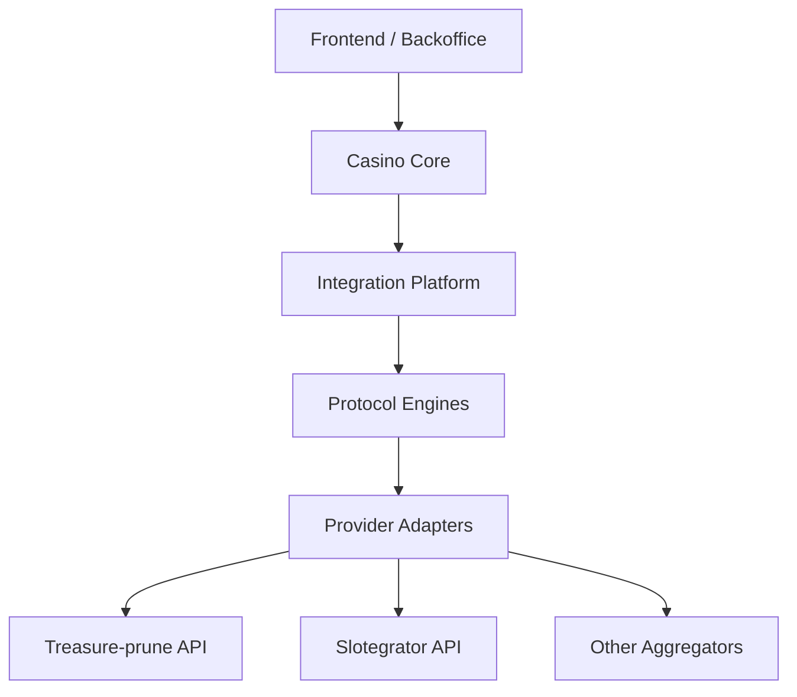
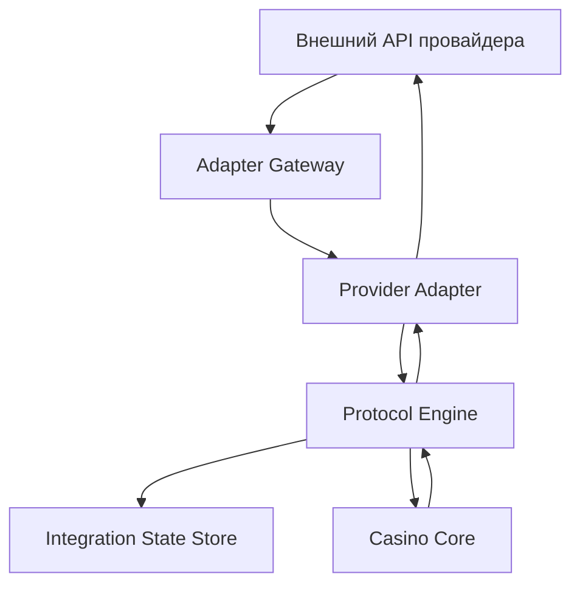

# Архитектура Интеграций Со Слот-Агрегаторами

## Оглавление

- [1. Вводная: какие типы API у слот-агрегаторов встречаются на рынке](#1-вводная-какие-типы-api-у-слот-агрегаторов-встречаются-на-рынке)
- [2. Treasure-prune API: как устроен подход](#2-treasure-prune-api-как-устроен-подход)
- [3. Slotegrator API: как устроен подход](#3-slotegrator-api-как-устроен-подход)
- [4. Ключевые различия Treasure-prune API и Slotegrator API](#4-ключевые-различия-treasure-prune-api-и-slotegrator-api)
- [5. Архитектура под 20-40 агрегаторов](#5-архитектура-под-20-40-агрегаторов)
- [6. Общие таблицы: что хранить в integration platform и что хранить в core казино](#6-общие-таблицы-что-хранить-в-integration-platform-и-что-хранить-в-core-казино)
- [7. Риски толстых адаптеров и риски раздутого общего оркестратора](#7-риски-толстых-адаптеров-и-риски-раздутого-общего-оркестратора)
- [8. Какое решение подходит конкретно для Treasure-prune API и Slotegrator API](#8-какое-решение-подходит-конкретно-для-treasure-prune-api-и-slotegrator-api)
- [9. Набросок внутреннего API казино](#9-набросок-внутреннего-api-казино)
- [10. Схема обработки в модульном слое оркестрации](#10-схема-обработки-в-модульном-слое-оркестрации)
- [11. Вывод](#11-вывод)
- [12. Источники](#12-источники)

---

## 1. Вводная: какие типы API у слот-агрегаторов встречаются на рынке

### 1.1. Важное уточнение про проценты

Ни у одного вендора нет общего открытого отчета по рынку с точным распределением типов API. Поэтому ниже не "официальная рыночная статистика", а **рабочая инженерная оценка** по открытым документациям агрегаторов и платформ. За основу взяты публично доступные документы, где явно видны модели `single wallet`, `seamless wallet`, `transfer wallet`, а также API с дополнительным управлением жизненным циклом транзакции.

### 1.2. Основные типы API

| Тип | Суть | Примерная доля | Как выглядит на практике |
| --- | --- | --- | --- |
| `Seamless wallet` / `Single wallet` | Деньги игрока хранятся у казино, а провайдер или агрегатор ходит в казино за балансом, списанием ставки, начислением выигрыша | `55-70%` | Самый частый паттерн: `balance -> bet/debit -> win/credit -> rollback/refund` |
| `Transfer wallet` / `Multi wallet` | Деньги игрока временно передаются в контур провайдера или отдельного игрового кошелька | `20-30%` | Нужны операции перевода средств между кошельками, а не только callbacks по ставкам |
| `Stateful seamless` / расширенный seamless | Seamless-схема, но с дополнительными командами управления судьбой транзакции после сбоя | `10-20%` | Помимо списания и начисления есть отдельные команды уровня `cancel`, `complete`, промо-шаги, служебные шаги риска |

### 1.3. Кратко о сути каждого подхода

#### 1.3.1. Seamless wallet

Это самый привычный вариант.

- Казино хранит баланс игрока.
- Игра живет у агрегатора или провайдера.
- Когда игрок делает ставку, агрегатор спрашивает у казино: можно ли списать деньги.
- Когда игрок выигрывает, агрегатор просит казино начислить выигрыш.

Плюсы:

- единый источник правды по балансу;
- проще контролировать ledger казино;
- удобнее делать единую историю операций.

Минусы:

- повышаются требования к надежности callback-обработки;
- при сбоях приходится хорошо обрабатывать повторы, rollback и несинхронность событий.

#### 1.3.2. Transfer wallet

Это более тяжелая схема.

- У казино есть основной баланс.
- У провайдера или агрегатора есть отдельный игровой кошелек.
- Перед началом игры средства переводятся в игровой контур, затем возвращаются обратно.

Плюсы:

- игровая платформа может быть более автономной;
- часть логики по текущим игровым движениям денег может оставаться снаружи.

Минусы:

- сложнее сверка;
- сложнее возвраты;
- выше риск расхождений между основным балансом казино и игровым балансом.

#### 1.3.3. Stateful seamless

Это промежуточный, но очень важный тип.

- Базово это seamless wallet.
- Но поверх него появляется дополнительный протокол управления жизненным циклом транзакции.
- То есть агрегатор не только просит "списать" или "начислить", но еще и потом отдельно говорит "отмени ту спорную операцию" или "считай ту спорную операцию завершенной".

Это именно тот случай, куда относится Treasure-prune API.

### 1.4. Почему именно такое распределение выглядит правдоподобным

По открытым документациям видно, что крупнейшие семейства интеграций вокруг казино и live-casino обычно сводятся к `single wallet` и `multi wallet`, причем `single wallet` указывается как базовый или один из основных режимов, а `multi wallet` или `transfer wallet` выделяется как отдельный режим интеграции. Это видно, например, у AllBet, где явно разведены `Single Wallet API (Seamless Wallet API) 2.0` и `Multi Wallet API (Transfer Wallet API) 2.0`, а также у GamesMatrix, где вынесен отдельный раздел `Seamless Wallet` для интеграции кошелька казино. Treasure-prune API и Slotegrator API дополнительно показывают, что внутри seamless-модели уже есть заметная доля расширенных вариантов: от "обычных" `balance/bet/win/refund/rollback` до моделей с `trx.cancel` и `trx.complete`.

---

## 2. Treasure-prune API: как устроен подход

### 2.1. Какие части API в нем есть

У Treasure-prune API есть две разные стороны:

- **Platform API**: казино ходит во внешнюю платформу;
- **Partner API**: внешняя платформа ходит в backend казино.

Это видно в структуре публичного описания API:

- `Platform API`: `/games.list`, `/currencies.list`, `/init.session`, `/init.demo.session`, `/close.session`, `/games.freeroundsInfo`
- `Partner API`: `/trx.cancel`, `/trx.complete`, `/check.session`, `/check.balance`, `/withdraw.bet`, `/deposit.win`

### 2.2. Как запускается игра

Принцип запуска у Treasure-prune API такой:

1. Казино получает список игр через `Platform API`.
2. Казино запрашивает ссылку на игровую сессию через `/init.session`.
3. Внешняя платформа возвращает данные сессии и токен.
4. Игрок запускает игру.

Ключевой метод:

- [`/init.session`](https://demo.superomatic.biz/doc/API_Platform.html)

### 2.3. Как Treasure-prune работает во время игры

Во время самой игры внешняя платформа начинает ходить в backend казино через `Partner API`.

Основные методы:

- [`/check.session`](https://demo.superomatic.biz/doc/Partner_API.html)
- [`/check.balance`](https://demo.superomatic.biz/doc/Partner_API.html)
- [`/withdraw.bet`](https://demo.superomatic.biz/doc/Partner_API.html)
- [`/deposit.win`](https://demo.superomatic.biz/doc/Partner_API.html)
- [`/trx.cancel`](https://demo.superomatic.biz/doc/Partner_API.html)
- [`/trx.complete`](https://demo.superomatic.biz/doc/Partner_API.html)

### 2.4. Что здесь особенно важно

Главная особенность Treasure-prune API не в самих методах `withdraw.bet` и `deposit.win`. Они по смыслу довольно стандартные:

- `withdraw.bet` = списать ставку;
- `deposit.win` = начислить выигрыш.

Настоящая особенность в том, что у API есть еще **отдельные управляющие методы**:

- `trx.cancel`
- `trx.complete`

Именно они показывают, что Treasure-prune считает транзакцию не просто одноразовым денежным событием, а сущностью со своим жизненным циклом.

То есть после сбоя платформа не ограничивается повторной отправкой денежного события, а может отдельной командой сказать:

- "отмени ту транзакцию";
- "считай ту транзакцию завершенной".

### 2.5. Что это означает для архитектуры казино

Если у интеграции есть `trx.cancel` и `trx.complete`, backend казино обязан помнить:

- что это была за внешняя транзакция;
- была ли она уже реально применена;
- какой ответ был отправлен наружу;
- надо ли делать компенсацию;
- надо ли только "дозакрыть" уже примененную операцию без повторного движения денег.

Именно поэтому Treasure-prune API нельзя считать чисто "статeless callback API".

`stateless` = без собственного состояния между вызовами.

Treasure-prune API на практике требует общего хранилища состояний внешних операций.

---

## 3. Slotegrator API: как устроен подход

### 3.1. Как запускается игра

У Slotegrator launch-flow явно описан через:

- `/games`
- `/games/lobby`
- `/games/init`
- `/games/init-demo`

Из документации:

- сначала игры кэшируются на стороне клиента;
- игра без lobby запускается через `/games/init`;
- игра с lobby сначала требует `/games/lobby`, а потом `/games/init`.

Ключевые методы:

- `GET /games`
- `GET /games/lobby`
- `POST /games/init`
- `POST /games/init-demo`

Карта по PDF:

| Метод или блок | Где смотреть в PDF |
| --- | --- |
| `/games` | `GIS-API_Slotegrator 1.4.4.pdf`, ранние разделы каталога игр |
| `/games/lobby` | `GIS-API_Slotegrator 1.4.4.pdf`, стр. `12` |
| `/games/init` | `GIS-API_Slotegrator 1.4.4.pdf`, стр. `12-13` |
| `/games/init-demo` | `GIS-API_Slotegrator 1.4.4.pdf`, стр. `13-14` |
| Launch flow summary | `GIS-API_Slotegrator 1.4.4.pdf`, стр. `5-6` |

### 3.2. Как Slotegrator работает во время игры

После запуска игры агрегатор ходит в callback-endpoint казино. В документации прямо сказано, что агрегатор может отправлять 4 типа вызовов:

- `balance`
- `win`
- `bet`
- `refund`

Дополнительно отдельно описан `rollback`.

Ключевые методы и действия:

- `action=balance`
- `action=bet`
- `action=win`
- `action=refund`
- `action=rollback`

Карта по PDF:

| Метод или блок | Где смотреть в PDF |
| --- | --- |
| `action=balance` | `GIS-API_Slotegrator 1.4.4.pdf`, стр. `16-17` |
| `action=bet` | `GIS-API_Slotegrator 1.4.4.pdf`, стр. `17-18` |
| `action=win` | `GIS-API_Slotegrator 1.4.4.pdf`, стр. `18-19` |
| `action=refund` | `GIS-API_Slotegrator 1.4.4.pdf`, стр. `19-20` |
| `action=rollback` | `GIS-API_Slotegrator 1.4.4.pdf`, стр. `20-21` |

### 3.3. Что особенно важно у Slotegrator

Slotegrator ближе к классическому callback-подходу, но в нем есть несколько важных деталей:

1. В документации для `/games/init` и seamless-транзакций отдельно описано, что:
   - у разных игровых действий может быть один и тот же `session_id` при разных `game_uuid`;
   - `bet` и `win` могут прийти с разными `session_id`, но с одним `round_id`.
2. Для `refund` прямо указано:
   - если исходной ставки еще нет, интегратор должен сохранить refund и ответить успехом.
3. Для `rollback` прямо указано:
   - интегратор должен отменять **только** операции из списка `rollback_transactions`;
   - не надо строить свою логику отката "по всему раунду" на основе `provider_round_id`.

Где это зафиксировано:

- `/games/init` и пояснение про разные `session_id` и общий `round_id`: `GIS-API_Slotegrator 1.4.4.pdf`, стр. `12-14`
- `refund` с требованием сохранить операцию, если исходного `bet` еще нет: `GIS-API_Slotegrator 1.4.4.pdf`, стр. `19-20`
- `rollback` с требованием обрабатывать только список `rollback_transactions`: `GIS-API_Slotegrator 1.4.4.pdf`, стр. `20-21`

### 3.4. Что это означает для архитектуры казино

Slotegrator можно считать **обычным callback API с неприятными edge-cases**.

`edge-case` = редкий, но реальный сложный сценарий.

Здесь все еще можно держать адаптер тонким, но общее ядро интеграций должно уметь:

- связывать разные внешние `session_id` с одним раундом;
- сохранять "осиротевшие" `refund`, если исходная ставка еще не найдена;
- обрабатывать пакетный `rollback` по списку транзакций;
- быть идемпотентным.

`идемпотентность` = защита от повторного применения одной и той же операции.

---

## 4. Ключевые различия Treasure-prune API и Slotegrator API

### 4.1. Разница в одном предложении

**Slotegrator API** в основном доставляет игровые денежные события.  
**Treasure-prune API** доставляет не только игровые денежные события, но еще и отдельные команды управления судьбой транзакции после сбоя.

### 4.2. Сравнение по методам

| Тема | Treasure-prune API | Slotegrator API | Почему это важно |
| --- | --- | --- | --- |
| Запуск игры | `/init.session`, `/init.demo.session` | `/games`, `/games/lobby`, `/games/init`, `/games/init-demo` | У Slotegrator launch-flow более "каталоговый", у Treasure-prune более "сессионный" |
| Проверка сессии | Есть `/check.session` | Нет отдельного явного аналога такого уровня | Treasure-prune сильнее завязан на проверку жизнеспособности внешней сессии |
| Баланс | `/check.balance` | `action=balance` | Функция похожа, упаковка разная |
| Списание ставки | `/withdraw.bet` | `action=bet` | Функция похожа, но Treasure-prune дальше продолжает управлять судьбой транзакции |
| Начисление выигрыша | `/deposit.win` | `action=win` | Функция похожа |
| Возврат/отмена | `/trx.cancel` | `action=refund`, `action=rollback` | Вот здесь начинается реальная разница |
| Завершение спорной операции | `/trx.complete` | Нет прямого аналога | Treasure-prune оперирует транзакцией как сущностью с отдельным этапом завершения |

### 4.3. Где Treasure-prune API сложнее именно по транзакциям

#### 4.3.1. Treasure-prune API

Treasure-prune API имеет пару:

- [`/withdraw.bet`](https://demo.superomatic.biz/doc/Partner_API.html)
- [`/deposit.win`](https://demo.superomatic.biz/doc/Partner_API.html)

Но поверх них дополнительно есть:

- [`/trx.cancel`](https://demo.superomatic.biz/doc/Partner_API.html)
- [`/trx.complete`](https://demo.superomatic.biz/doc/Partner_API.html)

Это означает, что у Treasure-prune внутренняя модель внешней транзакции должна хранить не только факт движения денег, но и состояние:

- получена;
- применена;
- под вопросом;
- отменена;
- дозавершена.

#### 4.3.2. Slotegrator API

У Slotegrator есть:

- `action=bet`
- `action=win`
- `action=refund`
- `action=rollback`

Из документации видно, что `refund` и `rollback` служат для исправления проблемных ситуаций, но отдельной универсальной пары "отмени именно эту спорную транзакцию" и "считай именно эту спорную транзакцию завершенной" у Slotegrator нет. Вместо этого приходят конкретные денежные корректирующие события.

### 4.4. Практический пример разницы

#### Сценарий: ставка списалась, но внешний ответ потерялся

**Treasure-prune API**

1. Приходит `withdraw.bet`.
2. Казино реально списывает деньги.
3. Ответ не доходит до платформы.
4. Потом платформа присылает `trx.cancel` или `trx.complete`.
5. Казино обязано найти исходную внешнюю транзакцию и:
   - либо компенсировать ее;
   - либо только пометить завершенной без повторного движения денег.

**Slotegrator API**

1. Приходит `action=bet`.
2. Казино списывает деньги.
3. Ответ может потеряться.
4. Потом агрегатор либо повторяет транзакцию, либо присылает `refund`, либо присылает `rollback`.
5. Казино работает через денежные корректирующие события, а не через общий протокол "судьбы исходной транзакции".

Опора в документации:

- `action=bet`: `GIS-API_Slotegrator 1.4.4.pdf`, стр. `17-18`
- `action=refund`: `GIS-API_Slotegrator 1.4.4.pdf`, стр. `19-20`
- `action=rollback`: `GIS-API_Slotegrator 1.4.4.pdf`, стр. `20-21`

### 4.5. Почему для Treasure-prune нужен более сильный слой оркестрации

Treasure-prune заставляет хранить состояние внешней операции на более длинной дистанции, потому что:

- `trx.cancel` может прийти позже;
- `trx.complete` может прийти позже;
- одно и то же движение денег надо уметь не повторить, но при этом корректно завершить снаружи.

Slotegrator тоже требует хранения состояния, но обычно на более "денежном" уровне:

- дубль `bet`;
- дубль `win`;
- поздний `refund`;
- пакетный `rollback`.

---

## 5. Архитектура под 20-40 агрегаторов

### 5.1. Неправильные крайности

Есть две плохие крайности.

#### Крайность 1. Сделать 20-40 толстых адаптеров

Проблемы:

- в каждом адаптере появится собственная логика дублей;
- в каждом появится своя логика rollback;
- в каждом появятся свои таблицы;
- изменения в общей денежной логике придется дублировать десятки раз.

#### Крайность 2. Сделать один огромный "супер-оркестратор"

Проблемы:

- он начнет знать слишком много о каждом провайдере;
- общая модель станет расползаться под частные исключения;
- новые интеграции будут ломать уже работающие сценарии.

### 5.2. Правильная цель

Нужно строить не "один оркестратор" и не "много толстых адаптеров", а **modular integration platform**.

`modular integration platform` = модульная платформа интеграций.

Она должна состоять из нескольких слоев.

### 5.3. Рекомендуемые слои



#### Слой 1. Casino Core

Это само казино:

- игроки;
- кошельки;
- бухгалтерский журнал денег;
- игровые сессии;
- игровые раунды;
- бонусный контур.

#### Слой 2. Integration Platform

Это общее ядро интеграций:

- хранение внешних сессий;
- хранение внешних раундов;
- хранение внешних транзакций;
- входящий журнал запросов;
- задачи компенсации;
- задачи сверки.

#### Слой 3. Protocol Engines

Это "движки семейств протоколов".

Например:

- `SeamlessWalletEngine`
- `StatefulTransactionEngine`
- `PromoEngine`

Идея здесь такая:

- у 20-40 API будет не 20-40 фундаментально разных жизненных циклов;
- чаще они разложатся на 3-5 семейств;
- новый адаптер должен подключаться к уже существующему движку.

#### Слой 4. Provider Adapters

Это уже переводчики конкретных API:

- проверка подписи;
- парсинг;
- преобразование полей;
- преобразование ответа обратно.

### 5.4. Как Treasure-prune и Slotegrator лягут в такую схему

#### Treasure-prune API

- адаптер: внешний формат, подпись, разбор методов;
- протокольный движок: `StatefulTransactionEngine`;
- integration platform: хранение внешних транзакций и состояний `cancel/complete`;
- core казино: фактическое списание и начисление денег.

#### Slotegrator API

- адаптер: `action=balance/bet/win/refund/rollback`, подпись, form-data;
- протокольный движок: `SeamlessWalletEngine` плюс модуль обработки пакетного rollback;
- integration platform: хранение `external_rounds`, `external_transactions`, "осиротевших" refund;
- core казино: фактическое движение денег.

---

## 6. Общие таблицы: что хранить в integration platform и что хранить в core казино

### 6.1. Таблицы integration platform

| Таблица | Зачем нужна |
| --- | --- |
| `providers` | Список агрегаторов и их настройки |
| `provider_capabilities` | Флаги возможностей: есть ли `cancel`, `complete`, `rollback`, promo-методы, странная модель сессий |
| `integration_inbox` | Журнал всех входящих внешних запросов |
| `integration_outbox` | Журнал наших исходящих команд во внешние API |
| `external_sessions` | Связь внешней игровой сессии с внутренней |
| `external_rounds` | Связь внешнего раунда с внутренним |
| `external_transactions` | Главная таблица внешних операций |
| `external_transaction_links` | Связи между исходной транзакцией и `cancel`, `complete`, `refund`, `rollback` |
| `pending_operations` | Операции, которые пока нельзя завершить сразу |
| `compensation_tasks` | Задачи на обратные действия |
| `reconciliation_issues` | Проблемы, найденные при сверке |
| `external_promo_state` | Состояние внешних промо-кампаний, если используется |

### 6.2. Зачем это все нужно на практике

#### `integration_inbox`

Если Treasure-prune повторно пришлет `withdraw.bet` с тем же `trx_id`, мы должны:

- узнать, что запрос уже был;
- не списать деньги второй раз;
- вернуть тот же результат.

#### `external_transactions`

Если позже придет `trx.complete`, мы должны:

- найти исходную внешнюю операцию;
- понять, был ли already applied внутренний debit или credit;
- второй раз не трогать деньги;
- правильно завершить только внешний статус.

#### `pending_operations`

Если у Slotegrator пришел `refund`, а исходная ставка еще не найдена, документация прямо требует сохранить refund и ответить успехом. Значит без отдельного состояния ожидания это не реализовать безопасно.

### 6.3. Таблицы core казино

| Таблица | Зачем нужна |
| --- | --- |
| `players` | Игроки |
| `wallets` | Текущие балансы игроков |
| `ledger_entries` | Бухгалтерский журнал движения денег |
| `games` | Каталог игр казино |
| `game_sessions` | Внутренние игровые сессии |
| `rounds` | Внутренние игровые раунды |
| `bonus_state` | Состояние бонусов и фриспинов |

### 6.4. Где проходит граница между таблицами

Простой принцип:

- **в integration platform** лежит все, что относится к внешнему миру;
- **в core казино** лежит все, что относится к деньгам, игрокам и внутреннему бизнес-состоянию казино.

Пример:

- внешний `trx_id` Treasure-prune = integration platform;
- проводка "списали 100 RUB у игрока" = core казино.

---

## 7. Риски толстых адаптеров и риски раздутого общего оркестратора

### 7.1. Риски толстых адаптеров

#### Риск 1. Разные правила идемпотентности в разных адаптерах

Конкретный кейс:

- Treasure-prune адаптер хранит дубли в своей таблице;
- Slotegrator адаптер хранит дубли в своей таблице;
- третий адаптер делает это в памяти, а не в базе;
- в результате поведение по дублям у всех разное.

Что происходит на практике:

- у одного провайдера повторный `bet` безопасен;
- у другого повторный `bet` случайно списывает деньги второй раз;
- отладка превращается в поиск "какой именно адаптер решил по-своему трактовать повтор".

#### Риск 2. Компенсации размазываются по проекту

Конкретный кейс:

- Treasure-prune прислал `trx.cancel`;
- разработчик добавил логику компенсации прямо в Treasure-prune адаптер;
- потом Slotegrator `refund` реализовали отдельным способом в другом адаптере.

Через время:

- два почти одинаковых механизма возврата денег живут в двух разных местах;
- в одном есть аудит;
- в другом нет;
- в одном используется правильная ledger-запись;
- в другом кто-то просто обновляет баланс.

#### Риск 3. Невозможно переиспользовать тесты

Конкретный кейс:

- нужно проверить сценарий "ответ на выигрыш потерялся, потом пришел повтор";
- если логика сидит в адаптере, тебе придется писать отдельный комплект тестов на каждый адаптер;
- если логика общая, тест один и он прогоняется на уровне движка протокола.

### 7.2. Риски раздутого общего оркестратора

#### Риск 1. Оркестратор начинает знать конкретные поля конкретных провайдеров

Конкретный кейс:

- в Slotegrator есть `rollback_transactions`;
- в Treasure-prune есть `trx.complete`;
- если общий оркестратор начнет сам разбирать их сырой payload, он постепенно превратится в "мега-адаптер", который знает частные форматы всех API.

Это ломает модульность.

#### Риск 2. Общая модель начинает искажаться под один сложный API

Конкретный кейс:

- Treasure-prune требует хранить состояния `cancel` и `complete`;
- если все ядро интеграций переписать только под это, то для обычных seamless API модель станет слишком сложной;
- каждый простой провайдер будет вынужден проходить через лишние состояния и лишние таблицы.

#### Риск 3. Любое исключение начинает взрывать весь общий контур

Конкретный кейс:

- добавили один особый hack для Slotegrator rollback;
- код попал в общий "главный обработчик";
- в итоге после обновления ломается повторная обработка Treasure-prune `deposit.win`.

То есть монолитный оркестратор создает сильную связанность.

### 7.3. Правильный компромисс

Не делать:

- 20-40 толстых адаптеров;
- один бог-объект вместо платформы интеграций.

Делать:

- тонкие или средние адаптеры;
- несколько протокольных движков;
- единое хранилище состояния интеграций;
- единый мост в ledger казино.

---

## 8. Какое решение подходит конкретно для Treasure-prune API и Slotegrator API

### 8.1. Для Treasure-prune API

Подходит такая связка:

- **адаптер**: тонкий;
- **движок**: `StatefulTransactionEngine`;
- **общие таблицы**: `external_transactions`, `external_transaction_links`, `integration_inbox`, `pending_operations`;
- **core казино**: `wallets`, `ledger_entries`, `rounds`.

Почему:

- ключевая сложность Treasure-prune не в формате запросов;
- ключевая сложность в том, что после `withdraw.bet` и `deposit.win` могут прийти `trx.cancel` и `trx.complete`.

### 8.2. Для Slotegrator API

Подходит такая связка:

- **адаптер**: тонкий или средний;
- **движок**: `SeamlessWalletEngine` с модулем обработки `refund/rollback`;
- **общие таблицы**: `external_rounds`, `external_transactions`, `pending_operations`, `integration_inbox`;
- **core казино**: `wallets`, `ledger_entries`, `rounds`.

Почему:

- Slotegrator не требует полноценного протокола `cancel/complete`;
- но он требует грамотной работы с:
  - `refund`, который может прийти раньше исходной ставки;
  - `rollback_transactions`;
  - `session_id` и `round_id`, которые могут вести себя неочевидно.

### 8.3. Что точно не нужно делать для этих двух интеграций

Не нужно:

- отдельный mini-core внутри каждого адаптера;
- отдельные per-provider таблицы денег;
- отдельную per-provider логику подсчета баланса;
- отдельные per-provider трактовки "что такое раунд" в обход общего ядра.

---

## 9. Набросок внутреннего API казино

Ниже не внешний API для фронта, а внутренний контракт между integration platform и core казино.

### 9.1. Игровые сессии

- `CreateGameSession`
- `CloseGameSession`
- `ValidateGameSession`

### 9.2. Баланс

- `GetPlayerBalance`

### 9.3. Деньги

- `ApplyBetDebit`
- `ApplyWinCredit`
- `ApplyRefund`
- `ApplyRollback`
- `ApplyCompensation`

### 9.4. Раунды

- `OpenRoundIfMissing`
- `AttachExternalTransactionToRound`
- `CloseRound`

### 9.5. Интеграционное состояние

- `RegisterExternalTransaction`
- `MarkExternalTransactionApplied`
- `MarkExternalTransactionCompleted`
- `MarkExternalTransactionCancelled`
- `SavePendingOperation`
- `ResolvePendingOperation`

### 9.6. Промо

- `ActivatePromoCampaign`
- `UpdatePromoCampaign`
- `CompletePromoCampaign`

### 9.7. Пример минимального внутреннего запроса на списание ставки

```json
{
  "provider": "treasure-prune",
  "external_transaction_id": "tx_1001",
  "external_session_id": "sess_01",
  "external_round_id": "round_77",
  "player_id": "player_42",
  "game_id": "book_of_sun",
  "amount": "100.00",
  "currency": "RUB",
  "kind": "bet"
}
```

Смысл:

- адаптер переводит внешний payload в этот внутренний формат;
- дальше core и integration platform уже не зависят от конкретного API провайдера.

---

## 10. Схема обработки в модульном слое оркестрации

### 10.1. Общая схема



### 10.2. Как это выглядит на Treasure-prune `withdraw.bet`

1. Treasure-prune присылает `withdraw.bet`.
2. Адаптер проверяет подпись и распаковывает payload.
3. Адаптер переводит запрос во внутреннюю команду `ApplyBetDebit`.
4. `StatefulTransactionEngine`:
   - проверяет `integration_inbox`;
   - проверяет, не был ли уже обработан `external_transaction_id`;
   - открывает или находит `external_round`;
   - вызывает core казино.
5. Core казино:
   - создает запись в `ledger_entries`;
   - обновляет `wallets`;
   - обновляет `rounds`.
6. Движок сохраняет внешний статус в `external_transactions`.
7. Ответ идет обратно через адаптер.

### 10.3. Как это выглядит на Treasure-prune `trx.complete`

1. Treasure-prune присылает `trx.complete`.
2. Адаптер переводит это во внутреннюю команду `MarkExternalTransactionCompleted`.
3. `StatefulTransactionEngine` ищет исходную внешнюю транзакцию.
4. Если внутренняя денежная операция уже была применена:
   - деньги повторно не двигаются;
   - обновляется только внешний статус.
5. Если операция еще не была применена:
   - движок завершает ее по правилам протокола.

### 10.4. Как это выглядит на Slotegrator `refund`

1. Slotegrator присылает `action=refund`.
2. Адаптер переводит это во внутреннюю команду `ApplyRefund`.
3. `SeamlessWalletEngine` ищет исходный `bet`.
4. Если исходный `bet` найден:
   - делает компенсацию через core казино;
   - обновляет `wallets`, `ledger_entries`, `rounds`.
5. Если исходный `bet` не найден:
   - кладет refund в `pending_operations`;
   - отвечает успехом, как того требует документация.

---

## 11. Вывод

Для Treasure-prune API и Slotegrator API нельзя ограничиться совсем тупыми прокси-адаптерами без общего состояния.

Но также не нужно делать отдельные толстые адаптеры, в которых будет жить собственная денежная логика.

Правильное решение для масштаба 20-40 интеграций такое:

- тонкие или средние адаптеры;
- общая integration platform;
- несколько protocol engines под семейства API;
- единое состояние внешних операций;
- единый ledger core казино.

Для этих двух интеграций это особенно важно, потому что:

- Treasure-prune API требует хранить состояние жизненного цикла внешней транзакции из-за `trx.cancel` и `trx.complete`;
- Slotegrator API требует хорошо держать state по `refund`, `rollback`, `session_id` и `round_id`, но не требует такого же отдельного протокола "дозавершения" транзакции.

Именно поэтому архитектура должна быть модульной, а не "либо все в адаптер, либо все в один гигантский оркестратор".

---

## 12. Источники

### Treasure-prune API

- Исходная публичная страница API:
  - [Treasure-prune API root](https://treasure-prune-f68.notion.site/API-4a13216644a44561abf7bde25ed462c0)
  - [Treasure-prune API Platform](https://treasure-prune-f68.notion.site/API-65578958615642d2b5eaa11fc371c0e6?pvs=25)
  - [Treasure-prune API Integration](https://treasure-prune-f68.notion.site/API-94ca981a658c4772920afac44fc414a3?pvs=25)

- Доступное публичное описание тех же method families, использованное для method-level ссылок и проверки структуры:
  - [Table of contents](https://demo.superomatic.biz/doc/contents.html)
  - [Partner API](https://demo.superomatic.biz/doc/Partner_API.html)
  - [Platform API](https://demo.superomatic.biz/doc/API_Platform.html)

### Slotegrator API

- Локальный документ, предоставленный пользователем:
  - `GIS-API_Slotegrator 1.4.4.pdf`

### Для вводной части по типам API

- [AllBet Integration Center: Single Wallet API / Multi Wallet API](https://www.abgintegration.com/en/?page=doc&wallet=mw2)
- [GamesMatrix wallet integration: seamless wallet](https://doc.gamesmatrix.com/wallet-integration/seamless-wallet)
