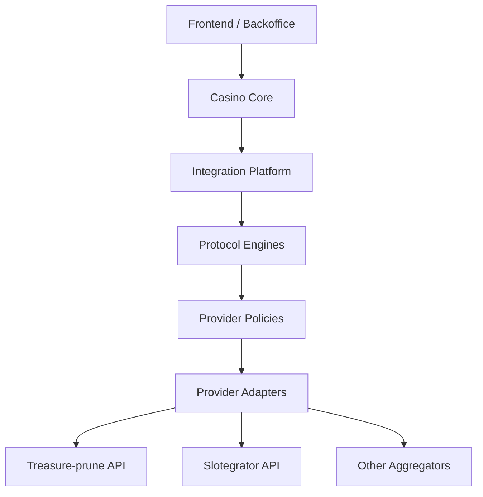
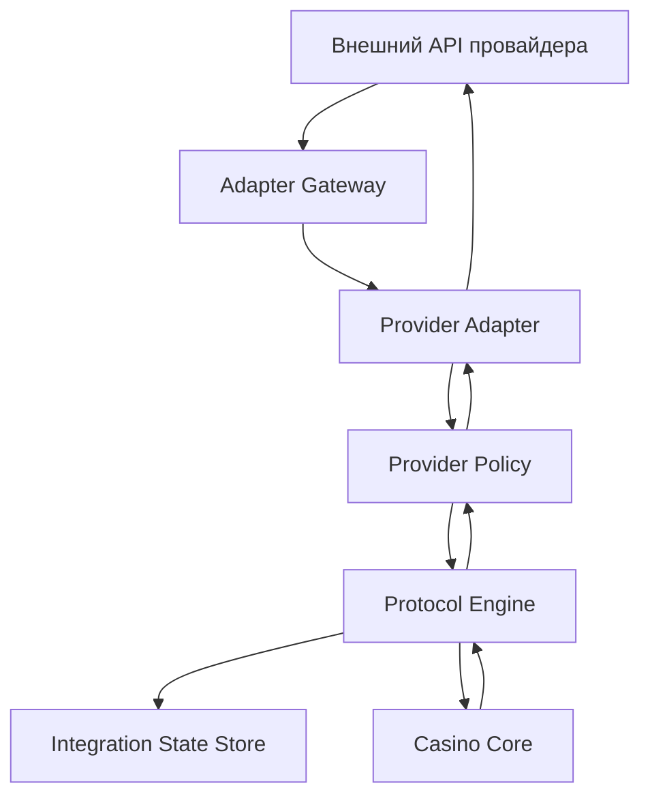

# Архитектура Интеграций Со Слот-Агрегаторами

## Оглавление

- [1. Вводная: какие модели API и семейства методов встречаются у слот-агрегаторов](#1-вводная-какие-модели-api-и-семейства-методов-встречаются-у-слот-агрегаторов)
- [2. Treasure-prune API: как устроен подход](#2-treasure-prune-api-как-устроен-подход)
- [3. Slotegrator API: как устроен подход](#3-slotegrator-api-как-устроен-подход)
- [4. Ключевые различия Treasure-prune API и Slotegrator API](#4-ключевые-различия-treasure-prune-api-и-slotegrator-api)
- [5. Архитектура под 20-40 агрегаторов](#5-архитектура-под-20-40-агрегаторов)
- [6. Общие таблицы: что хранить в integration platform и что хранить в core казино](#6-общие-таблицы-что-хранить-в-integration-platform-и-что-хранить-в-core-казино)
- [7. Риски толстых адаптеров и риски раздутого общего оркестратора](#7-риски-толстых-адаптеров-и-риски-раздутого-общего-оркестратора)
- [8. Какое решение подходит конкретно для Treasure-prune API и Slotegrator API](#8-какое-решение-подходит-конкретно-для-treasure-prune-api-и-slotegrator-api)
- [9. Набросок внутреннего API казино](#9-набросок-внутреннего-api-казино)
- [10. Схема обработки в модульном слое оркестрации](#10-схема-обработки-в-модульном-слое-оркестрации)
- [11. Практический Пример: Классы, Таблицы И Flow](./ARCHITECTURE_EXAMPLE.md)
- [12. Вывод](#12-вывод)
- [13. Источники](#13-источники)

---

## 1. Вводная: какие модели API и семейства методов встречаются у слот-агрегаторов

### 1.1. Базовые wallet-модели

Если говорить именно про **денежную модель интеграции**, то по открытым и подтверждаемым документациям базовых схем в основном две:

| Модель | Где лежат деньги игрока | Как выглядит на практике | Что это значит для архитектуры |
| --- | --- | --- | --- |
| `Seamless wallet` / `Single wallet` | Баланс игрока остается у казино | Провайдер или агрегатор вызывает `balance`, `bet/debit`, `win/credit`, `rollback/refund` | Нужны сильная идемпотентность, быстрые callbacks, единый ledger и хорошая обработка повторов |
| `Transfer wallet` / `Multi wallet` | Часть средств временно живет во внешнем игровом кошельке | Помимо игровых событий появляются переводы между кошельками, reserve/transfer in/transfer out | Нужны отдельные сценарии пополнения игрового кошелька, возврата средств и сверки двух контуров |

Важно: это именно **два базовых wallet-подхода**. Они описывают, где находятся деньги и кто двигает баланс во время игры.

Отдельно внутри `Seamless` встречается более сложный вариант:

- `Extended seamless`
- `Recovery-aware seamless`

У этой модели:

- деньги все еще лежат у казино;
- базовые методы похожи на `bet/debit` и `win/credit`;
- но поверх них появляются методы отмены, дозавершения и других служебных шагов;
- системе уже нужно помнить не только деньги, но и состояние внешней операции.

Treasure-prune относится именно к такому варианту.

### 1.2. Какие семейства методов встречаются в этих моделях

Кроме самих денежных методов у провайдеров обычно есть еще несколько **семейств методов**.

| Семейство методов | Где обычно встречается | Для чего нужно | Примеры |
| --- | --- | --- | --- |
| `Запуск игры` | И в `Seamless`, и в `Transfer` | Получить ссылку запуска, разделить demo и real-money поток | `games.start`, `games.startDemo`, `get game URL`, `direct-to-lobby` |
| `Сессия и доступ` | И в `Seamless`, и в `Transfer` | Проверить сессию, токен, право доступа к игре | `check.session`, `verify player`, token exchange |
| `Каталог и контент` | И в `Seamless`, и в `Transfer` | Получить список игр, провайдеров, тегов, метаданных | `games.list`, catalog, game metadata |
| `Деньги во время игры` | В любой денежной модели | Списать ставку, начислить выигрыш, вернуть средства | `balance`, `bet`, `win`, `refund`, `withdraw.bet`, `deposit.win` |
| `Управление спорной операцией` | Чаще в расширенном `Seamless` | Отменить, дозавершить или отдельно обработать спорную транзакцию | `cancel`, `rollback`, `trx.cancel`, `trx.complete` |
| `Промо и бонусы` | Может быть и в `Seamless`, и в `Transfer` | Фриспины, бонусные шаги, активация и завершение кампаний | `freerounds.*`, promo methods |
| `Отчеты и сверка` | Обычно отдельный служебный контур | Найти транзакцию, собрать отчет, провести сверку | transaction lookup, reports, reconciliation |
| `Риск, тесты, тех. вызовы` | Обычно отдельный служебный контур | Технические шаги, тестовые вызовы, compliance-сценарии | `risk.step`, testing, regulatory callbacks |

Важно:

- это **не отдельные модели API**;
- это именно **семейства методов**, которые встречаются внутри разных моделей.

### 1.3. Кратко о сути базовых подходов

#### 1.3.1. Seamless wallet

Это самый привычный вариант.

- Казино хранит баланс игрока.
- Игра живет у агрегатора или провайдера.
- Когда игрок делает ставку, агрегатор спрашивает у казино: можно ли списать деньги.
- Когда игрок выигрывает, агрегатор просит казино начислить выигрыш.

Плюсы:

- единый источник правды по балансу;
- проще контролировать ledger казино;
- удобнее делать единую историю операций.

Минусы:

- повышаются требования к надежности callback-обработки;
- при сбоях приходится хорошо обрабатывать повторы, rollback и несинхронность событий.

#### 1.3.2. Transfer wallet

Это более тяжелая схема.

- У казино есть основной баланс.
- У провайдера или агрегатора есть отдельный игровой кошелек.
- Перед началом игры средства переводятся в игровой контур, затем возвращаются обратно.

Плюсы:

- игровая платформа может быть более автономной;
- часть логики по текущим игровым движениям денег может оставаться снаружи.

Минусы:

- сложнее сверка;
- сложнее возвраты;
- выше риск расхождений между основным балансом казино и игровым балансом.

#### 1.3.3. Extended / recovery-aware seamless

Это не отдельная модель хранения денег, а **усложненный вариант seamless-интеграции**.

- Базово это seamless wallet.
- Но поверх него появляется дополнительный протокол управления жизненным циклом транзакции.
- То есть агрегатор не только просит "списать" или "начислить", но еще и потом отдельно говорит "отмени ту спорную операцию" или "считай ту спорную операцию завершенной".

Это именно тот случай, куда относится Treasure-prune API.

### 1.4. Что подтверждается документами

По открытым документациям хорошо подтверждаются такие выводы:

- `Single wallet / Seamless wallet` и `Multi wallet / Transfer wallet` реально существуют как отдельные режимы интеграции;
- рядом с wallet API почти всегда живут и другие контуры: запуск игры, авторизация, каталог игр, бонусы, отчеты, сервисные методы;
- часть seamless API действительно имеет расширенный recovery-layer поверх обычных денежных методов;
- Treasure-prune относится именно к такому случаю: это seamless по модели денег, но с дополнительным lifecycle через `trx.cancel` и `trx.complete`.

То есть главный вывод вводной части теперь такой:

- если обсуждаем **деньги**, то базовых моделей в первую очередь две: `Seamless` и `Transfer`;
- если обсуждаем **полный интеграционный ландшафт**, то рядом с wallet API почти всегда есть и другие семейства методов.

### 1.5. Как читать этот документ

Связанные документы:

- [ARCHITECTURE_EXAMPLE.md](./ARCHITECTURE_EXAMPLE.md)
- [API_Slotegrator.md](./API_Slotegrator.md)
- [API_Treasure-prune.md](./API_Treasure-prune.md)
- [API_Treasure-prune_source.md](./API_Treasure-prune_source.md)

Если нужен не обзор, а **приземленный пример классов, интерфейсов, таблиц и sequence flow**, см. [ARCHITECTURE_EXAMPLE.md](./ARCHITECTURE_EXAMPLE.md).

---

## 2. Treasure-prune API: как устроен подход

### 2.1. Какие части API в нем есть

У Treasure-prune API есть две разные стороны:

- **Platform API**: казино ходит во внешнюю платформу;
- **Partner API**: внешняя платформа ходит в backend казино.

Для Treasure-prune надежно подтвержден такой минимум:

- в `API Платформы` явно видны `/games.list` и `/netent.freeroundsInfo`;
- в `API Интеграции` явно видны `/check.session`, `/check.balance`, `/withdraw.bet`, `/deposit.win`, `/trx.cancel`, `/trx.complete`, а также дополнительные `freerounds.*` и `risk.step`;
- запуск игр показан через `games.startDemo` и `games.start`, то есть как launch URL-поток, а не как отдельный callback-контур.

### 2.2. Как запускается игра

Demo и real-money запуск надо различать.

`games.startDemo`:

- в источнике показан как launch URL с demo-параметрами;
- в source нет надежного подтверждения, что demo-поток использует тот же server-side денежный контур, что real money.

`games.start`:

- в источнике показан как launch URL для real money;
- именно для него надежно подтверждено, что платформа может ходить в backend партнера через `API Интеграции`.

Значит архитектурный вывод такой:

- нельзя без проверки считать demo-режим полноценным участником того же transaction lifecycle;
- все выводы про `check.session`, `check.balance`, `withdraw.bet`, `deposit.win`, `trx.cancel`, `trx.complete` надо делать для real-money контура.

### 2.3. Как Treasure-prune работает во время игры

Во время самой игры внешняя платформа начинает ходить в backend казино через `Partner API`.

Основные методы денежного и recovery-контура:

- `/check.session`
- `/check.balance`
- `/withdraw.bet`
- `/deposit.win`
- `/trx.cancel`
- `/trx.complete`

Operational-детали, которые обязательно влияют на архитектуру:

- `API Платформы` использует `POST(HTTP)` и `application/x-www-form-urlencoded`;
- `API Интеграции` использует `POST(HTTP)` и `JSON body`;
- для входящих запросов в партнера есть подпись;
- заявлены `Connect timeout = 1s` и `Read timeout = 3s`.

Еще важнее то, что здесь видны **разные recovery policies**:

- `check.session` и `check.balance` относятся к `Stop on fail`;
- `withdraw.bet` и `freerounds.activate` относятся к `Cancel on undefined behavior`;
- `deposit.win` и `freerounds.complete` относятся к `Proceed on fail`.

### 2.4. Что здесь особенно важно

Главная особенность Treasure-prune API не в самих методах `withdraw.bet` и `deposit.win`. Они по смыслу довольно стандартные:

- `withdraw.bet` = списать ставку;
- `deposit.win` = начислить выигрыш.

Настоящая особенность в том, что у API есть еще **отдельные управляющие методы**:

- `trx.cancel`
- `trx.complete`

Именно они показывают, что Treasure-prune считает транзакцию не просто одноразовым денежным событием, а сущностью со своим жизненным циклом.

Это выражено совсем конкретно:

- при неопределенном результате на `withdraw.bet` платформа запускает отмену через `trx.cancel`;
- при неопределенном результате на `deposit.win` платформа запускает отложенное завершение через `trx.complete`;
- текущие настройки, зафиксированные в source, указывают на повторные recovery-попытки через `5` и `15` секунд.

То есть после сбоя платформа не ограничивается повторной отправкой денежного события, а может отдельной командой сказать:

- "отмени ту транзакцию";
- "считай ту транзакцию завершенной".

Отдельно важно, что:

- `freerounds.*` и `risk.step` описаны как дополнительные сценарии;
- их нельзя без уточнения считать безусловным минимумом для каждого партнера.

### 2.5. Что это означает для архитектуры казино

Если у интеграции есть `trx.cancel` и `trx.complete`, backend казино обязан помнить:

- что это была за внешняя транзакция;
- была ли она уже реально применена;
- какой ответ был отправлен наружу;
- надо ли делать компенсацию;
- надо ли только "дозакрыть" уже примененную операцию без повторного движения денег.

Именно поэтому Treasure-prune API нельзя считать чисто "статeless callback API".

`stateless` = без собственного состояния между вызовами.

Treasure-prune API на практике требует общего хранилища состояний внешних операций.

Причем это хранилище должно держать не только сам факт операции, но и:

- recovery policy конкретного provider flow;
- связку "исходный запрос -> контейнерный `trx.cancel` или `trx.complete`";
- сохраненный ответ, который уже был отдан наружу;
- optional feature-профиль по `freerounds.*` и `risk.step`, чтобы не раздувать обязательный базовый контур там, где провайдер этого не требует.

---

## 3. Slotegrator API: как устроен подход

### 3.1. Как запускается игра

У Slotegrator launch-flow явно описан через:

- `/games`
- `/games/lobby`
- `/games/init`
- `/games/init-demo`

Из документации:

- сначала игры кэшируются на стороне клиента;
- игра без lobby запускается через `/games/init`;
- игра с lobby сначала требует `/games/lobby`, а потом `/games/init`.

Ключевые методы:

- `GET /games`
- `GET /games/lobby`
- `POST /games/init`
- `POST /games/init-demo`

Карта по PDF:

| Метод или блок | Где смотреть в PDF |
| --- | --- |
| `/games` | `GIS-API_Slotegrator 1.4.4.pdf`, ранние разделы каталога игр |
| `/games/lobby` | `GIS-API_Slotegrator 1.4.4.pdf`, стр. `12` |
| `/games/init` | `GIS-API_Slotegrator 1.4.4.pdf`, стр. `12-13` |
| `/games/init-demo` | `GIS-API_Slotegrator 1.4.4.pdf`, стр. `13-14` |
| Launch flow summary | `GIS-API_Slotegrator 1.4.4.pdf`, стр. `5-6` |

Operational-деталь из [API_Slotegrator.md](./API_Slotegrator.md), которая обязательно должна жить в архитектурном документе, потому что влияет на go-live:

- после завершения интеграции казино должно передать Slotegrator production IP-адреса;
- эти IP должны быть добавлены в whitelist;
- при смене инфраструктуры whitelist нужно обновлять, иначе интеграция может стать недоступной.

### 3.2. Как Slotegrator работает во время игры

После запуска игры агрегатор ходит в callback-endpoint казино. В документации прямо сказано, что агрегатор может отправлять 4 типа вызовов:

- `balance`
- `win`
- `bet`
- `refund`

Дополнительно отдельно описан `rollback`.

Ключевые методы и действия:

- `action=balance`
- `action=bet`
- `action=win`
- `action=refund`
- `action=rollback`

Карта по PDF:

| Метод или блок | Где смотреть в PDF |
| --- | --- |
| `action=balance` | `GIS-API_Slotegrator 1.4.4.pdf`, стр. `16-17` |
| `action=bet` | `GIS-API_Slotegrator 1.4.4.pdf`, стр. `17-18` |
| `action=win` | `GIS-API_Slotegrator 1.4.4.pdf`, стр. `18-19` |
| `action=refund` | `GIS-API_Slotegrator 1.4.4.pdf`, стр. `19-20` |
| `action=rollback` | `GIS-API_Slotegrator 1.4.4.pdf`, стр. `20-21` |

Для архитектуры тут важны не только сами actions, но и operational envelope из [API_Slotegrator.md](./API_Slotegrator.md):

- callbacks подписываются через `X-Merchant-Id`, `X-Timestamp`, `X-Nonce`, `X-Sign`;
- подпись строится не только по body, но и по auth headers;
- timestamp считается просроченным после `30 секунд`;
- если callback обрабатывается дольше `3 секунд`, агрегатор может перейти к retry/recovery сценарию.

### 3.3. Что особенно важно у Slotegrator

Slotegrator ближе к классическому callback-подходу, но в нем есть несколько важных деталей:

1. В документации для `/games/init` и seamless-транзакций отдельно описано, что:
   - у разных игровых действий может быть один и тот же `session_id` при разных `game_uuid`;
   - `bet` и `win` могут прийти с разными `session_id`, но с одним `round_id`.
2. Для `refund` прямо указано:
   - если исходной ставки еще нет, интегратор должен сохранить refund и ответить успехом.
3. Для `rollback` прямо указано:
   - интегратор должен отменять **только** операции из списка `rollback_transactions`;
   - не надо строить свою логику отката "по всему раунду" на основе `provider_round_id`.
4. Также важно, что:
   - после таймаута агрегатор может прислать `refund`, повторный `refund`, повторный `rollback` или другие повторные callback-вызовы;
   - значит провайдер по факту работает в модели `at-least-once delivery`, а не "ровно один раз".
5. Помимо основного денежного контура у Slotegrator есть дополнительные контуры:
   - `GET /limits`, `GET /limits/freespin`;
   - `GET /jackpots` и `POST /balance/notify`, помеченные как `LEGACY`;
   - `Freespins API`;
   - `Freevouchers API`;
   - `POST /self-validate`.

Где это зафиксировано:

- `/games/init` и пояснение про разные `session_id` и общий `round_id`: `GIS-API_Slotegrator 1.4.4.pdf`, стр. `12-14`
- `refund` с требованием сохранить операцию, если исходного `bet` еще нет: `GIS-API_Slotegrator 1.4.4.pdf`, стр. `19-20`
- `rollback` с требованием обрабатывать только список `rollback_transactions`: `GIS-API_Slotegrator 1.4.4.pdf`, стр. `20-21`
- подпись и timestamp: `GIS-API_Slotegrator 1.4.4.pdf`, стр. `6-7`, `15`
- timeout `3 секунды`: `GIS-API_Slotegrator 1.4.4.pdf`, стр. `14`
- promo, legacy и self-validation контуры: см. [API_Slotegrator.md](./API_Slotegrator.md)

### 3.4. Что это означает для архитектуры казино

Slotegrator можно считать **обычным callback API с неприятными edge-cases**.

`edge-case` = редкий, но реальный сложный сценарий.

Здесь все еще можно держать адаптер тонким, но общее ядро интеграций должно уметь:

- связывать разные внешние `session_id` с одним раундом;
- сохранять "осиротевшие" `refund`, если исходная ставка еще не найдена;
- обрабатывать пакетный `rollback` по списку транзакций;
- быть идемпотентным;
- укладываться в короткий callback SLA;
- отдельно учитывать optional promo/legacy/self-validation контуры, не смешивая их с базовой денежной моделью.

`идемпотентность` = защита от повторного применения одной и той же операции.

---

## 4. Ключевые различия Treasure-prune API и Slotegrator API

### 4.1. Разница в одном предложении

**Slotegrator API** в основном доставляет игровые денежные события.  
**Treasure-prune API** доставляет не только игровые денежные события, но еще и отдельные команды управления судьбой транзакции после сбоя.

### 4.2. Сравнение по методам

| Тема | Treasure-prune API | Slotegrator API | Почему это важно |
| --- | --- | --- | --- |
| Запуск игры | `games.startDemo` / `games.start` по локальному source, при этом server-side денежный контур надежно подтвержден для real money | `/games`, `/games/lobby`, `/games/init`, `/games/init-demo` | У Slotegrator launch-flow более "каталоговый", а у Treasure-prune важно не перепутать demo-link и real-money server-side flow |
| Проверка сессии | Есть `/check.session` | Нет отдельного явного аналога такого уровня | Treasure-prune сильнее завязан на проверку жизнеспособности внешней сессии |
| Баланс | `/check.balance` | `action=balance` | Функция похожа, упаковка разная |
| Списание ставки | `/withdraw.bet` | `action=bet` | Функция похожа, но Treasure-prune дальше продолжает управлять судьбой транзакции |
| Начисление выигрыша | `/deposit.win` | `action=win` | Функция похожа |
| Возврат/отмена | `/trx.cancel` | `action=refund`, `action=rollback` | Вот здесь начинается реальная разница |
| Завершение спорной операции | `/trx.complete` | Нет прямого аналога | Treasure-prune оперирует транзакцией как сущностью с отдельным этапом завершения |
| Транспорт и envelope | `Platform API` = form-urlencoded, `Integration API` = JSON body, recovery-политики зафиксированы в source | form-urlencoded и HMAC headers в обе стороны, очень короткий callback SLA | Транспорт и retry-модель влияют на границу между adapter, provider policy и engine |
| Дополнительные контуры | `freerounds.*`, `risk.step` как feature-dependent расширения | `Freespins`, `Freevouchers`, `self-validate`, `LEGACY` endpoints | Не все провайдерские расширения надо тащить в базовый money-flow |

### 4.3. Где Treasure-prune API сложнее именно по транзакциям

#### 4.3.1. Treasure-prune API

Treasure-prune API имеет пару:

- [`/withdraw.bet`](https://demo.superomatic.biz/doc/Partner_API.html)
- [`/deposit.win`](https://demo.superomatic.biz/doc/Partner_API.html)

Но поверх них дополнительно есть:

- [`/trx.cancel`](https://demo.superomatic.biz/doc/Partner_API.html)
- [`/trx.complete`](https://demo.superomatic.biz/doc/Partner_API.html)

Это означает, что у Treasure-prune внутренняя модель внешней транзакции должна хранить не только факт движения денег, но и состояние:

- получена;
- применена;
- под вопросом;
- отменена;
- дозавершена.

#### 4.3.2. Slotegrator API

У Slotegrator есть:

- `action=bet`
- `action=win`
- `action=refund`
- `action=rollback`

Из документации видно, что `refund` и `rollback` служат для исправления проблемных ситуаций, но отдельной универсальной пары "отмени именно эту спорную транзакцию" и "считай именно эту спорную транзакцию завершенной" у Slotegrator нет. Вместо этого приходят конкретные денежные корректирующие события.

### 4.4. Практический пример разницы

#### Сценарий: ставка списалась, но внешний ответ потерялся

**Treasure-prune API**

1. Приходит `withdraw.bet`.
2. Казино реально списывает деньги.
3. Ответ не доходит до платформы.
4. Потом платформа присылает `trx.cancel` или `trx.complete`.
5. Казино обязано найти исходную внешнюю транзакцию и:
   - либо компенсировать ее;
   - либо только пометить завершенной без повторного движения денег.

**Slotegrator API**

1. Приходит `action=bet`.
2. Казино списывает деньги.
3. Ответ может потеряться.
4. Потом агрегатор либо повторяет транзакцию, либо присылает `refund`, либо присылает `rollback`.
5. Казино работает через денежные корректирующие события, а не через общий протокол "судьбы исходной транзакции".

Опора в документации:

- `action=bet`: `GIS-API_Slotegrator 1.4.4.pdf`, стр. `17-18`
- `action=refund`: `GIS-API_Slotegrator 1.4.4.pdf`, стр. `19-20`
- `action=rollback`: `GIS-API_Slotegrator 1.4.4.pdf`, стр. `20-21`

### 4.5. Почему для Treasure-prune нужен более сильный слой оркестрации

Treasure-prune заставляет хранить состояние внешней операции на более длинной дистанции, потому что:

- `trx.cancel` может прийти позже;
- `trx.complete` может прийти позже;
- одно и то же движение денег надо уметь не повторить, но при этом корректно завершить снаружи.

Slotegrator тоже требует хранения состояния, но обычно на более "денежном" уровне:

- дубль `bet`;
- дубль `win`;
- поздний `refund`;
- пакетный `rollback`.

---

## 5. Архитектура под 20-40 агрегаторов

### 5.1. Неправильные крайности

Есть две плохие крайности.

#### Крайность 1. Сделать 20-40 толстых адаптеров

Проблемы:

- в каждом адаптере появится собственная логика дублей;
- в каждом появится своя логика rollback;
- в каждом появятся свои таблицы;
- изменения в общей денежной логике придется дублировать десятки раз.

#### Крайность 2. Сделать один огромный "супер-оркестратор"

Проблемы:

- он начнет знать слишком много о каждом провайдере;
- общая модель станет расползаться под частные исключения;
- новые интеграции будут ломать уже работающие сценарии.

### 5.2. Правильная цель

Нужно строить не "один оркестратор" и не "много толстых адаптеров", а **modular integration platform**.

`modular integration platform` = модульная платформа интеграций.

Она должна состоять из нескольких слоев.

### 5.3. Рекомендуемые слои



#### Слой 1. Casino Core

Это само казино:

- игроки;
- кошельки;
- бухгалтерский журнал денег;
- игровые сессии;
- игровые раунды;
- бонусный контур.

#### Слой 2. Integration Platform

Это общее ядро интеграций:

- хранение внешних сессий;
- хранение внешних раундов;
- хранение внешних транзакций;
- входящий журнал запросов;
- задачи компенсации;
- задачи сверки.

#### Слой 3. Protocol Engines

Это "движки семейств протоколов".

Например:

- `SeamlessWalletEngine`
- `StatefulTransactionEngine`
- `TransferWalletEngine`
- `PromoEngine`

Идея здесь такая:

- у 20-40 API будет не 20-40 фундаментально разных жизненных циклов;
- чаще они разложатся на 3 основных движка и 1 дополнительный `PromoEngine`, плюс несколько более простых контуров без отдельного движка;
- новый адаптер должен подключаться к уже существующему движку.

#### Слой 4. Provider Policies

Здесь живут **provider-specific правила**, которые уже нельзя назвать чистым transport/parsing, но еще нельзя пускать в общий protocol engine:

- как именно матчить `session_id`, `round_id`, `provider_round_id`, `game_uuid`;
- какие optional поля и контуры реально включены для данного мерчанта;
- какие методы обязательны, а какие feature-dependent;
- какая recovery policy применяется к конкретному family flow;
- какие provider edge-cases допустимы без изменения общей денежной модели.

Именно этот слой делает "средний адаптер" допустимым:

- он может быть толще transport-adapter;
- но он не должен содержать собственный ledger, собственные правила double-spend или отдельную money-модель.

#### Слой 5. Provider Adapters

Это уже переводчики конкретных API:

- проверка подписи;
- парсинг;
- преобразование полей;
- преобразование ответа обратно.

### 5.4. Как модели и семейства методов ложатся на слои

Здесь уже можно говорить про движки и раскладку по слоям.

Главное правило такое:

- **формат запроса и ответа** лежит в `Provider Adapter`;
- **нюансы конкретного провайдера** лежат в `Provider Policy`;
- **повторяемая логика обработки** лежит в `Protocol Engine`;
- **внешнее состояние и связи** лежат в `Integration Platform`;
- **списание, начисление и ledger** лежат в `Casino Core`.

То есть разница между API не должна целиком жить "в адаптере" или "в движке". Она делится по смыслу.

#### Какие семейства методов требуют отдельный движок

| Семейство методов | Где реализуется основной контур | Нужен ли отдельный движок |
| --- | --- | --- |
| `Запуск игры` | `Adapter + Policy + прикладной сервис` | Обычно нет |
| `Сессия и доступ` | `Adapter + Policy + прикладной сервис` | Обычно нет |
| `Каталог и контент` | `Adapter + прикладной сервис` | Обычно нет |
| `Деньги во время игры` в `Seamless` | `SeamlessWalletEngine` | Да |
| `Деньги во время игры` в `Transfer` | `TransferWalletEngine` | Да |
| `Управление спорной операцией` | `StatefulTransactionEngine` | Да |
| `Промо и бонусы` | `PromoEngine` или `прикладной сервис` | Иногда |
| `Отчеты и сверка` | `Adapter + сервис отчетов` | Обычно нет |
| `Риск, тесты, тех. вызовы` | `Adapter + прикладной сервис` | Обычно нет |

Итог по движкам:

- для `Slotegrator + Treasure-prune` достаточно `2` движков: `SeamlessWalletEngine` и `StatefulTransactionEngine`;
- для целевой платформы разумно держать `3` основных движка: `SeamlessWalletEngine`, `StatefulTransactionEngine`, `TransferWalletEngine`;
- `PromoEngine` стоит добавлять только если бонусный контур реально становится общим и сложным.

#### Где должны жить нюансы конкретного API

| Что именно различается | Где это реализуется |
| --- | --- |
| `form-data` vs `JSON`, подпись, headers, response format | `Provider Adapter` |
| demo-vs-real, matching round/session, optional методы, retry semantics | `Provider Policy` |
| duplicate handling, pending, lifecycle операции, shared runtime-flow | `Protocol Engine` |
| inbox, external transactions, links, pending, promo state | `Integration Platform` |
| баланс, проводки, внутренние раунды | `Casino Core` |

Короткие примеры:

- `Slotegrator refund before bet`
  `Adapter` парсит `action=refund`, `Policy` разрешает такой порядок, `SeamlessWalletEngine` кладет событие в `pending_operations`, `Integration Platform` хранит ожидание и связь, `Core` не двигает деньги второй раз.

- `Treasure-prune trx.complete`
  `Adapter` разбирает `/trx.complete`, `Policy` задает правило поиска исходной операции, `StatefulTransactionEngine` завершает внешний жизненный цикл, `Integration Platform` обновляет статус и связи, `Core` меняет деньги только при необходимости.

- `games.startDemo`
  `Adapter` собирает launch payload, `Policy` подсказывает особенности demo-потока, дальше работает обычный service-слой без отдельного движка.

### 5.5. Как Treasure-prune и Slotegrator лягут в такую схему

#### Treasure-prune API

- адаптер: внешний формат, подпись, разбор методов;
- provider policy: `CancelOnUndefinedBehavior`, `ProceedOnFail`, demo-vs-real-money distinction, optional `freerounds.*` и `risk.step`;
- протокольный движок: `StatefulTransactionEngine`;
- integration platform: хранение внешних транзакций и состояний `cancel/complete`;
- core казино: фактическое списание и начисление денег.

#### Slotegrator API

- адаптер: `action=balance/bet/win/refund/rollback`, подпись, auth-headers, form-data;
- provider policy: round-correlation strategy, timeout budget, whitelist/go-live requirements, promo/legacy/self-validation flags;
- протокольный движок: `SeamlessWalletEngine` плюс модуль обработки пакетного rollback;
- integration platform: хранение `external_rounds`, `external_transactions`, "осиротевших" refund, promo state;
- core казино: фактическое движение денег.

---

## 6. Общие таблицы: что хранить в integration platform и что хранить в core казино

### 6.1. Таблицы integration platform

| Таблица | Зачем нужна |
| --- | --- |
| `providers` | Список агрегаторов и их настройки |
| `provider_capabilities` | Базовые флаги возможностей: есть ли `cancel`, `complete`, `rollback`, promo-методы, `LEGACY` endpoints |
| `provider_policies` | Нормализованные provider-specific правила: correlation strategy, timeout budget, retry semantics, feature-dependent методы, ответ на duplicates |
| `integration_inbox` | Журнал всех входящих внешних запросов |
| `integration_outbox` | Журнал наших исходящих команд во внешние API |
| `external_sessions` | Связь внешней игровой сессии с внутренней |
| `external_rounds` | Связь внешнего раунда с внутренним |
| `external_transactions` | Главная таблица внешних операций |
| `external_transaction_links` | Связи между исходной транзакцией и `cancel`, `complete`, `refund`, `rollback` |
| `pending_operations` | Операции, которые пока нельзя завершить сразу |
| `compensation_tasks` | Задачи на обратные действия |
| `reconciliation_issues` | Проблемы, найденные при сверке |
| `external_promo_state` | Состояние внешних промо-кампаний, если используется |

### 6.2. Зачем это все нужно на практике

#### `integration_inbox`

Если Treasure-prune повторно пришлет `withdraw.bet` с тем же `trx_id`, мы должны:

- узнать, что запрос уже был;
- не списать деньги второй раз;
- вернуть тот же результат.

#### `external_transactions`

Если позже придет `trx.complete`, мы должны:

- найти исходную внешнюю операцию;
- понять, был ли already applied внутренний debit или credit;
- второй раз не трогать деньги;
- правильно завершить только внешний статус.

#### `pending_operations`

Если у Slotegrator пришел `refund`, а исходная ставка еще не найдена, документация прямо требует сохранить refund и ответить успехом. Значит без отдельного состояния ожидания это не реализовать безопасно.

### 6.3. Таблицы core казино

| Таблица | Зачем нужна |
| --- | --- |
| `players` | Игроки |
| `wallets` | Текущие балансы игроков |
| `ledger_entries` | Бухгалтерский журнал движения денег |
| `games` | Каталог игр казино |
| `game_sessions` | Внутренние игровые сессии |
| `rounds` | Внутренние игровые раунды |
| `bonus_state` | Состояние бонусов и фриспинов |

### 6.4. Где проходит граница между таблицами

Простой принцип:

- **в integration platform** лежит все, что относится к внешнему миру;
- **в core казино** лежит все, что относится к деньгам, игрокам и внутреннему бизнес-состоянию казино.

Пример:

- внешний `trx_id` Treasure-prune = integration platform;
- проводка "списали 100 RUB у игрока" = core казино.

### 6.5. Формальная модель корректности

Для обеих интеграций нужно считать, что внешний мир работает как минимум в модели **at-least-once delivery**:

- запрос может повториться;
- ответ может потеряться;
- recovery-команда может прийти позже денежной операции;
- callback может прийти раньше связанной с ним операции.

Значит внутренняя модель должна гарантировать следующее:

1. **Exactly-once на уровне денег, а не на уровне HTTP.**
   Внешний запрос может прийти несколько раз, но внутренняя денежная проводка должна примениться не более одного раза.
2. **Канонический dedupe key.**
   Минимум нужен ключ вида:
   - `provider`
   - `provider_operation_kind`
   - `external_transaction_id` или эквивалентный provider transaction key
   - при необходимости batch/key envelope для `rollback`.
3. **Атомарная граница записи.**
   В одном transactional boundary должны согласованно обновляться:
   - `integration_inbox`;
   - `external_transactions` и `external_transaction_links`;
   - внутренний money-effect в `ledger_entries`;
   - сохраненный canonical response для повторного ответа наружу.
4. **Replay того же ответа на duplicate.**
   При повторе нельзя заново исполнять money-flow; нужно вернуть тот же бизнес-результат или ту же семантику ответа.
5. **Блокировка конкурентных путей.**
   Нужна защита от гонок минимум по:
   - внешней транзакции;
   - кошельку игрока;
   - внутреннему раунду или его связи с внешним раундом.
6. **Pending и compensation как first-class state.**
   `refund before bet`, `trx.cancel`, `trx.complete`, поздний `rollback` должны жить как состояния и переходы, а не как ad-hoc код в адаптере.
7. **Provider-specific SLA и retry policy хранятся отдельно от money-логики.**
   Например:
   - у Slotegrator критичен callback budget около `3 секунд`;
   - у Treasure-prune важны recovery-вызовы через `5` и `15` секунд для `trx.cancel` и `trx.complete`.

### 6.6. Правило раскладки логики по слоям

Чтобы больше не спорить абстрактно про "толстые адаптеры", полезно зафиксировать простое правило:

- **Provider Adapter**:
  - transport;
  - auth/signature;
  - raw payload parsing;
  - provider response envelope.
- **Provider Policy**:
  - как матчить внешние ids;
  - какие optional методы реально включены;
  - какие provider edge-cases допустимы;
  - какой timeout/retry profile у данного provider family.
- **Protocol Engine**:
  - общая логика семейства `SeamlessWallet`, `StatefulTransaction`, `Promo`;
  - идемпотентность семейства;
  - orchestration переходов состояния;
  - общие тестируемые инварианты.
- **Casino Core**:
  - проводки денег;
  - баланс;
  - внутренний round/session lifecycle;
  - invariants ledger и anti-double-spend.

Из этого следует практический вывод:

- "средний адаптер" допустим, если это по сути `Provider Policy`;
- "толстый адаптер" становится плохим, когда в нем начинает жить собственная денежная семантика.

### 6.7. Как это тестировать

Чтобы такая архитектура не превратилась просто в красивую схему, тесты тоже нужно раскладывать по слоям:

- **Provider Adapter tests**:
  - подпись;
  - разбор raw payload;
  - serialization ответа;
  - backward compatibility конкретного provider format.
- **Provider Policy tests**:
  - correlation rules;
  - optional fields и feature flags;
  - mapping provider edge-cases во внутренние команды.
- **Protocol Engine contract tests**:
  - duplicate `bet` / `win`;
  - `refund before bet`;
  - `rollback only by list`;
  - `trx.cancel` после уже примененного `withdraw.bet`;
  - `trx.complete` после неясного `deposit.win`.
- **Core / ledger invariant tests**:
  - деньги не применяются дважды;
  - баланс и ledger согласованы;
  - компенсация пишет корректную проводку, а не просто меняет balance.

Именно такой расклад тестов делает shared engine безопасным:

- provider-specific исключения ловятся на policy/adaptor-уровне;
- общие money-invariants проверяются один раз и переиспользуются всеми интеграциями.

---

## 7. Риски толстых адаптеров и риски раздутого общего оркестратора

### 7.1. Риски толстых адаптеров

#### Риск 1. Разные правила идемпотентности в разных адаптерах

Конкретный кейс:

- Treasure-prune адаптер хранит дубли в своей таблице;
- Slotegrator адаптер хранит дубли в своей таблице;
- третий адаптер делает это в памяти, а не в базе;
- в результате поведение по дублям у всех разное.

Что происходит на практике:

- у одного провайдера повторный `bet` безопасен;
- у другого повторный `bet` случайно списывает деньги второй раз;
- отладка превращается в поиск "какой именно адаптер решил по-своему трактовать повтор".

#### Риск 2. Компенсации размазываются по проекту

Конкретный кейс:

- Treasure-prune прислал `trx.cancel`;
- разработчик добавил логику компенсации прямо в Treasure-prune адаптер;
- потом Slotegrator `refund` реализовали отдельным способом в другом адаптере.

Через время:

- два почти одинаковых механизма возврата денег живут в двух разных местах;
- в одном есть аудит;
- в другом нет;
- в одном используется правильная ledger-запись;
- в другом кто-то просто обновляет баланс.

#### Риск 3. Невозможно переиспользовать тесты

Конкретный кейс:

- нужно проверить сценарий "ответ на выигрыш потерялся, потом пришел повтор";
- если логика сидит в адаптере, тебе придется писать отдельный комплект тестов на каждый адаптер;
- если логика общая, тест один и он прогоняется на уровне движка протокола.

### 7.2. Риски раздутого общего оркестратора

#### Риск 1. Оркестратор начинает знать конкретные поля конкретных провайдеров

Конкретный кейс:

- в Slotegrator есть `rollback_transactions`;
- в Treasure-prune есть `trx.complete`;
- если общий оркестратор начнет сам разбирать их сырой payload, он постепенно превратится в "мега-адаптер", который знает частные форматы всех API.

Это ломает модульность.

#### Риск 2. Общая модель начинает искажаться под один сложный API

Конкретный кейс:

- Treasure-prune требует хранить состояния `cancel` и `complete`;
- если все ядро интеграций переписать только под это, то для обычных seamless API модель станет слишком сложной;
- каждый простой провайдер будет вынужден проходить через лишние состояния и лишние таблицы.

#### Риск 3. Любое исключение начинает взрывать весь общий контур

Конкретный кейс:

- добавили один особый hack для Slotegrator rollback;
- код попал в общий "главный обработчик";
- в итоге после обновления ломается повторная обработка Treasure-prune `deposit.win`.

То есть монолитный оркестратор создает сильную связанность.

### 7.3. Правильный компромисс

Не делать:

- 20-40 толстых адаптеров;
- один бог-объект вместо платформы интеграций.

Делать:

- тонкие или средние адаптеры;
- несколько протокольных движков;
- отдельный слой provider policies;
- единое хранилище состояния интеграций;
- единый мост в ledger казино.

---

## 8. Какое решение подходит конкретно для Treasure-prune API и Slotegrator API

### 8.1. Для Treasure-prune API

Подходит такая связка:

- **адаптер**: тонкий;
- **provider policy**: отдельная;
- **движок**: `StatefulTransactionEngine`;
- **общие таблицы**: `external_transactions`, `external_transaction_links`, `integration_inbox`, `pending_operations`, `compensation_tasks`;
- **core казино**: `wallets`, `ledger_entries`, `rounds`.

Почему:

- ключевая сложность Treasure-prune не в формате запросов;
- ключевая сложность в том, что после `withdraw.bet` и `deposit.win` могут прийти `trx.cancel` и `trx.complete`;
- `withdraw.bet` и `deposit.win` имеют разные recovery policies;
- demo-flow и real-money flow не надо автоматически сводить к одному и тому же runtime-контру;
- `freerounds.*` и `risk.step` лучше держать как feature-dependent расширения provider policy, а не как обязательный минимум всего ядра.

### 8.2. Для Slotegrator API

Подходит такая связка:

- **адаптер**: тонкий или средний;
- **provider policy**: обязательная;
- **движок**: `SeamlessWalletEngine` с модулем обработки `refund/rollback`;
- **общие таблицы**: `external_rounds`, `external_transactions`, `pending_operations`, `integration_inbox`, `external_promo_state`;
- **core казино**: `wallets`, `ledger_entries`, `rounds`.

Почему:

- Slotegrator не требует полноценного протокола `cancel/complete`;
- но он требует грамотной работы с:
  - `refund`, который может прийти раньше исходной ставки;
  - `rollback_transactions`;
  - `session_id` и `round_id`, которые могут вести себя неочевидно;
  - коротким callback SLA;
  - promo/self-validation/legacy контурами, которые не надо смешивать с базовым wallet engine.

### 8.3. Что точно не нужно делать для этих двух интеграций

Не нужно:

- отдельный mini-core внутри каждого адаптера;
- отдельные per-provider таблицы денег;
- отдельную per-provider логику подсчета баланса;
- отдельные per-provider трактовки "что такое раунд" в обход общего ядра.

### 8.4. Когда "средний адаптер" действительно допустим

Да, у вас была правильная интуиция: полностью "тупой proxy-adapter" здесь недостаточен.

Но рабочая середина выглядит так:

- допустим средний adapter/controller, если он:
  - знает provider-specific поля и edge-cases;
  - умеет выбрать нужную provider policy;
  - не исполняет деньги сам;
  - не хранит собственный money-ledger;
  - не вводит свою трактовку идемпотентности отдельно от платформы интеграций.

То есть практический компромисс формулируется лучше так:

- **не тонкий любой ценой**;
- **не толстый money-adapter**;
- **а adapter + provider policy поверх общих engine и ledger invariants**.

---

## 9. Набросок внутреннего API казино

Ниже не внешний API для фронта, а внутренний контракт между integration platform и core казино.

При этом лучше разделять **два внутренних контракта**, а не складывать все в один список команд:

- `Provider Adapter / Provider Policy -> Protocol Engine`
- `Protocol Engine -> Casino Core`

Иначе есть риск, что:

- либо core начнет знать слишком много о внешней модели провайдера;
- либо orchestration превратится в бог-объект.

### 9.1. Игровые сессии

- `CreateGameSession`
- `CloseGameSession`
- `ValidateGameSession`

### 9.2. Баланс

- `GetPlayerBalance`

### 9.3. Деньги

- `ApplyBetDebit`
- `ApplyWinCredit`
- `ApplyRefund`
- `ApplyRollback`
- `ApplyCompensation`

### 9.4. Раунды

- `OpenRoundIfMissing`
- `AttachExternalTransactionToRound`
- `CloseRound`

### 9.5. Интеграционное состояние

- `RegisterExternalTransaction`
- `MarkExternalTransactionApplied`
- `MarkExternalTransactionCompleted`
- `MarkExternalTransactionCancelled`
- `SavePendingOperation`
- `ResolvePendingOperation`

### 9.6. Промо

- `ActivatePromoCampaign`
- `UpdatePromoCampaign`
- `CompletePromoCampaign`

### 9.7. Пример минимального внутреннего запроса на списание ставки

```json
{
  "provider": "treasure-prune",
  "external_transaction_id": "tx_1001",
  "external_session_id": "sess_01",
  "external_round_id": "round_77",
  "player_id": "player_42",
  "game_id": "book_of_sun",
  "amount": "100.00",
  "currency": "RUB",
  "kind": "bet"
}
```

Смысл:

- адаптер переводит внешний payload в этот внутренний формат;
- дальше provider policy, protocol engine, core и integration platform уже не зависят от сырого формата конкретного API провайдера.

---

## 10. Схема обработки в модульном слое оркестрации

### 10.1. Общая схема



### 10.2. Как это выглядит на Treasure-prune `withdraw.bet`

1. Treasure-prune присылает `withdraw.bet`.
2. Адаптер проверяет подпись и распаковывает payload.
3. Provider policy определяет, что это real-money debit с policy `CancelOnUndefinedBehavior`.
4. Адаптер переводит запрос во внутреннюю команду `ApplyBetDebit`.
5. `StatefulTransactionEngine`:
   - проверяет `integration_inbox`;
   - проверяет, не был ли уже обработан `external_transaction_id`;
   - открывает или находит `external_round`;
   - либо возвращает сохраненный ответ на duplicate;
   - вызывает core казино.
6. Core казино:
   - создает запись в `ledger_entries`;
   - обновляет `wallets`;
   - обновляет `rounds`.
7. Движок сохраняет внешний статус в `external_transactions`.
8. Ответ идет обратно через адаптер.

### 10.3. Как это выглядит на Treasure-prune `trx.complete`

1. Treasure-prune присылает `trx.complete`.
2. Provider policy определяет, к какому исходному flow относится completion.
3. Адаптер переводит это во внутреннюю команду `MarkExternalTransactionCompleted`.
4. `StatefulTransactionEngine` ищет исходную внешнюю транзакцию.
5. Если внутренняя денежная операция уже была применена:
   - деньги повторно не двигаются;
   - обновляется только внешний статус.
6. Если операция еще не была применена:
   - движок завершает ее по правилам протокола.

### 10.4. Как это выглядит на Slotegrator `refund`

1. Slotegrator присылает `action=refund`.
2. Адаптер проверяет подпись, timestamp и auth headers.
3. Provider policy выбирает round-correlation strategy и подтверждает, что refund может быть orphan.
4. Адаптер переводит это во внутреннюю команду `ApplyRefund`.
5. `SeamlessWalletEngine` ищет исходный `bet`.
6. Если исходный `bet` найден:
   - делает компенсацию через core казино;
   - обновляет `wallets`, `ledger_entries`, `rounds`.
7. Если исходный `bet` не найден:
   - кладет refund в `pending_operations`;
   - отвечает успехом, как того требует документация.

---

## 12. Вывод

Для Treasure-prune API и Slotegrator API нельзя ограничиться совсем тупыми прокси-адаптерами без общего состояния.

Но также не нужно делать отдельные толстые адаптеры, в которых будет жить собственная денежная логика.

Правильное решение для масштаба 20-40 интеграций такое:

- тонкие или средние адаптеры;
- отдельный слой provider policies;
- общая integration platform;
- несколько protocol engines под семейства API;
- единое состояние внешних операций;
- единый ledger core казино.

Для этих двух интеграций это особенно важно, потому что:

- Treasure-prune API требует хранить состояние жизненного цикла внешней транзакции из-за `trx.cancel` и `trx.complete`, а также не смешивать demo-link и real-money runtime-flow;
- Slotegrator API требует хорошо держать state по `refund`, `rollback`, `session_id` и `round_id`, учитывать короткий callback SLA, подпись, whitelist и отдельные promo/legacy/self-validation контуры, но не требует такого же отдельного протокола "дозавершения" транзакции.

Именно поэтому архитектура должна быть модульной, а не "либо все в адаптер, либо все в один гигантский оркестратор".

Окончательная формулировка спора про адаптеры такая:

- **толстые адаптеры как место для provider-specific orchestration** могут быть рабочими;
- **толстые адаптеры как место для собственной money-логики** для этого масштаба уже плохая цель;
- правильный компромисс: `Provider Adapter + Provider Policy + Protocol Engine + единый ledger/core`.

---

## 13. Источники

### Treasure-prune API

- Основная локальная сводка по репозиторию:
  - [API_Treasure-prune.md](./API_Treasure-prune.md)
- Собранный source:
  - [API_Treasure-prune_source.md](./API_Treasure-prune_source.md)
- Исходная публичная страница API:
  - [Treasure-prune API root](https://treasure-prune-f68.notion.site/API-4a13216644a44561abf7bde25ed462c0)
  - [Treasure-prune API Platform](https://treasure-prune-f68.notion.site/API-65578958615642d2b5eaa11fc371c0e6?pvs=25)
  - [Treasure-prune API Integration](https://treasure-prune-f68.notion.site/API-94ca981a658c4772920afac44fc414a3?pvs=25)

- Доступное публичное описание тех же method families, использованное для method-level ссылок и проверки структуры:
  - [Table of contents](https://demo.superomatic.biz/doc/contents.html)
  - [Partner API](https://demo.superomatic.biz/doc/Partner_API.html)
  - [Platform API](https://demo.superomatic.biz/doc/API_Platform.html)

### Slotegrator API

- Основная локальная сводка по репозиторию:
  - [API_Slotegrator.md](./API_Slotegrator.md)
- Локальный документ, предоставленный пользователем:
  - [GIS-API_Slotegrator 1.4.4.pdf](./GIS-API_Slotegrator%201.4.4.pdf)

### Для вводной части по типам API

- [AllBet Integration Center: Single Wallet API / Multi Wallet API](https://www.abgintegration.com/en/?page=doc&wallet=mw2)
- [GamesMatrix wallet integration: seamless wallet](https://doc.gamesmatrix.com/wallet-integration/seamless-wallet)
- [GamesMatrix wallet integration: transfer wallet](https://doc.gamesmatrix.com/wallet-integration/transfer-wallet)
- [Casino Game: Authentication / Get game URL](https://docs.casinogame.com/api-reference/authentication)
- [Casino Game: Seamless wallet](https://docs.casinogame.com/api-reference/wallet-integration)
- [ST8 Operator API: wallet, launch, query, bonus, regulatory, testing](https://docs.st8api.com/)
